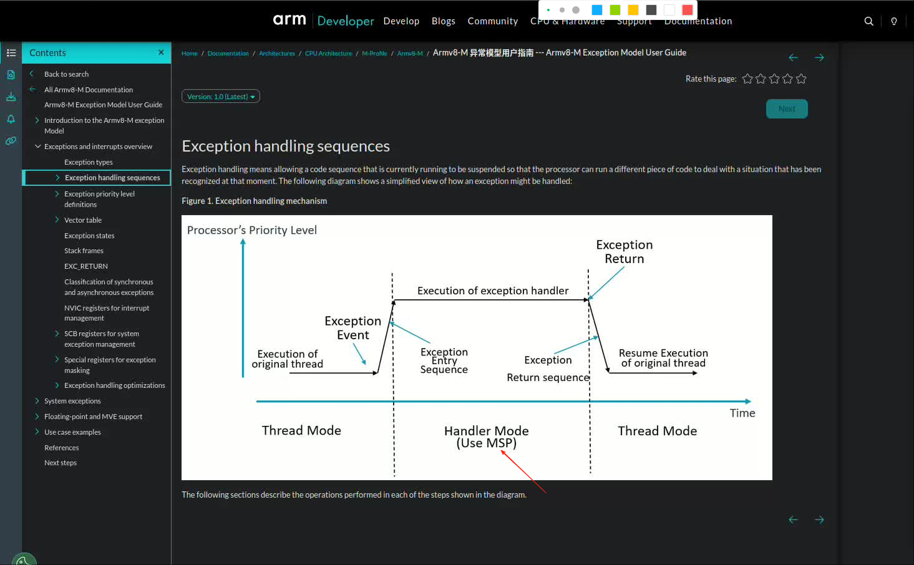
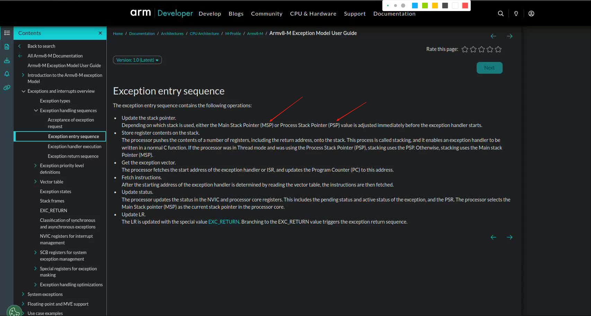
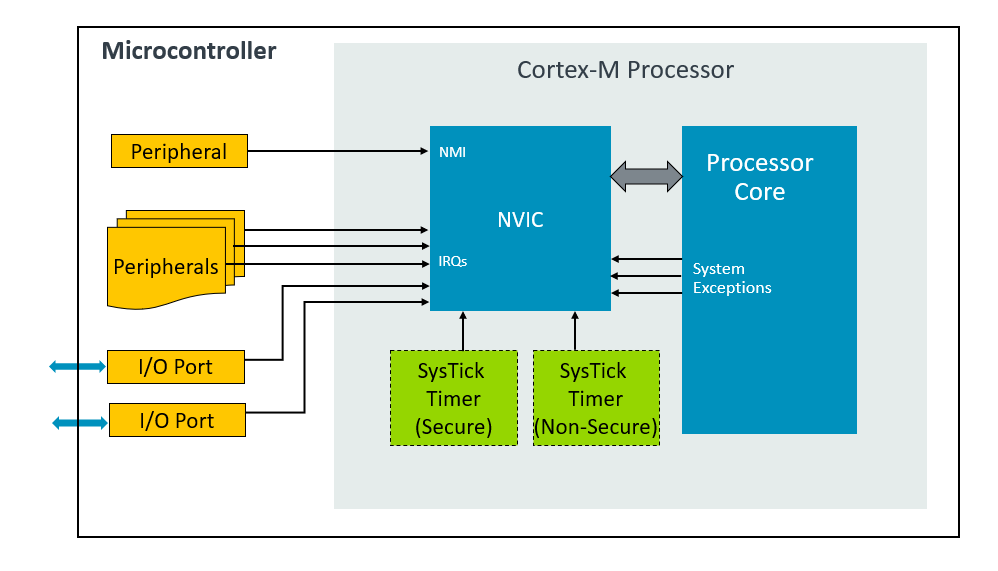
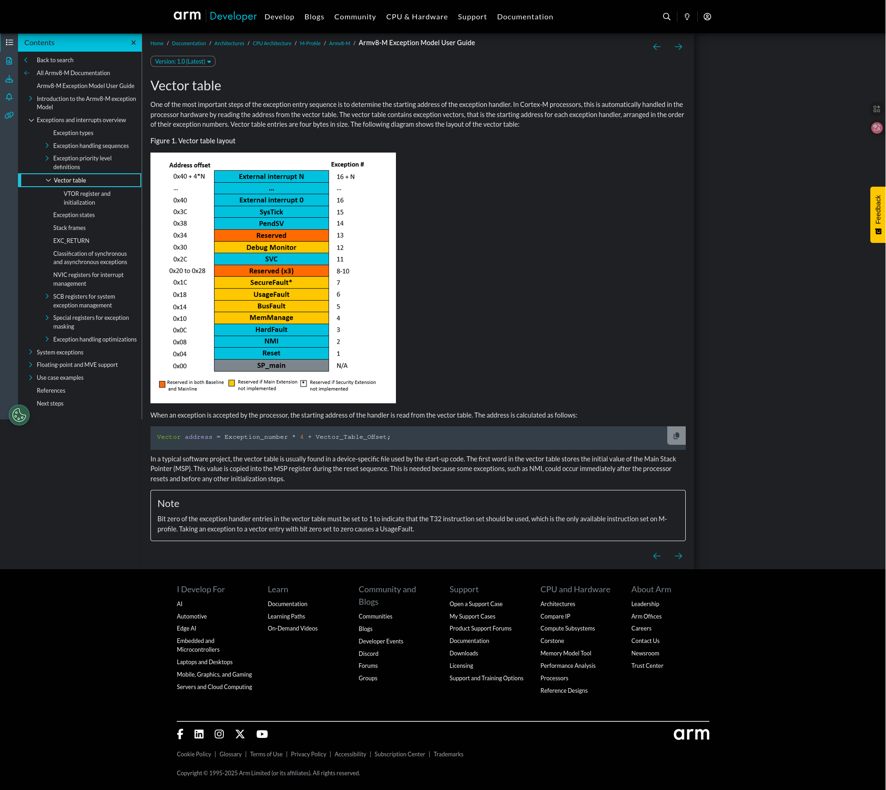

# Armv8-M Exception Model
学习: [Armv8-M Exception Model User Guide](../../002.REF_DOCS/armv8-m_exception_model_user_guide_107706_0100_01_en.pdf)  & [Armv8-M Security Extension User Guide](../../002.REF_DOCS/armv8-m_security_extension_user_guide_107655_100_01_en.pdf)

## STM32 异常处理流程
学习 [Armv8-M Exception Model User Guide#Exception handling sequences](../../002.REF_DOCS/armv8-m_exception_model_user_guide_107706_0100_01_en.pdf)

- 
   + 这个**MSP**<sub>Main Stack Pointer</sub>堆栈指针是用于操作系统内核，异常/中断处理。 还有一个是**PSP**<sub>Process Stack Pointer</sub>,用于一般的应用程序线程
     - 设计目的: 系统稳定性和安全性，实现内核与应用的隔离

**具体的异常处理流程**，参考：
- 

更多，真的要好好阅读文档了，这里只是摘要

---

## 异常优先级
学习 [Armv8-M Security Extension User Guide#Exception prioritization](../../002.REF_DOCS/armv8-m_security_extension_user_guide_107655_100_01_en.pdf) & [Armv8-M Exception Model User Guide#Exception priority level definitions](../../002.REF_DOCS/armv8-m_exception_model_user_guide_107706_0100_01_en.pdf) 可以了解到具体的异常优先级

-   其中有一句话，说明了优先级是否可以被抢占
  + The exception priority level determines whether an incoming exception can be pre-empted by the processor:(异常优先级确定处理器是否可以抢占传入异常：)
    - If the incoming exception event has a higher priority level than the processor’s current priority level, then the exception request is accepted and the exception entry sequence starts.（如果传入异常事件的优先级高于处理器当前优先级，则接受该异常请求并启动异常响应流程。）
    - If the incoming exception event has the same or a lower priority level than the processor’s current priority level, then the incoming exception request is held in pending state. This pending scenario can be caused by the following conditions:（如果传入异常事件的优先级等于或低于处理器当前优先级，则该异常请求将保持挂起状态。这种挂起状态可能由以下情况引起：）
       + The processor is already serving another exception of the same or higher priority level, or（处理器正在处理相同或更高优先级的其他异常，或者）
       + A priority boosting register is set which changes the processor’s current effective priority level to the same or higher priority level as the incoming exception.（当优先级提升寄存器被设置时，处理器的当前有效优先级将变为与传入异常相同或更高的级别）


---

## NVIC<sub>Nested Vectored Interrupt Controller</sub>
[Armv8-M Exception Model User Guide #Exception handling sequences](../../002.REF_DOCS/armv8-m_exception_model_user_guide_107706_0100_01_en.pdf)

Cortex-M processors provide a Nested Vectored Interrupt Controller (NVIC) for interrupt handling.(Cortex-M 处理器提供用于中断处理的嵌套矢量中断控制器 （NVIC）)

- 
- 

The NVIC is responsible for deciding which code stream the processor should be executing at any given time. It is also responsible for managing the current execution priority and the priorities assigned to all exception types. For most exceptions, the NVIC also takes care of whether each individual exception is enabled or not. Some exceptions are always enabled.（**NVIC（嵌套向量中断控制器）负责决定处理器在任何给定时刻应执行哪段代码流，同时负责管理当前执行优先级以及分配给所有异常类型的优先级**。对于大多数异常，NVIC还负责处理每个独立异常的启用或禁用状态，但某些异常始终处于启用状态。）

## 中断向量表
解析 [startup_stm32f10x_md.s](../../000.STM32/000.STM32F103C8T6/000.STM32F103C8T6_1/002.BASE_LIBS/device_libs/startup_stm32f10x_md.s) 来分析中断向量表

得结合[Vector table](https://developer.arm.com/documentation/107706/0100/Exceptions-and-interrupts-overview/Vector-table?lang=en) (如下图)来学习了
- 

```asm

    定义中断向量表:
    .section	.isr_vector,"a",%progbits

   	.word	SVC_Handler
    // .word 是一个汇编器指令，它的作用是：在当前位置保留一个内存字（32位，4字节）的空间，并用指定的值或地址来初始化这个空间,简单来说，它就是在内存中定义一个 32 位的数值。这个数值可以是一个具体的数字，也可以是一个符号（比如函数名）代表的地址
    // SVC_Handler 是一个符号，通常代表一个中断服务函数的入口地址
    // .word SVC_Handler 这行代码的含义是： 在当前的内存位置，存放一个 32 位的值，这个值就是 SVC_Handler 这个函数的入口地址
```

---

## 异常类型
学习 [Armv8-M Security Extension User Guide#Target states of exceptions](../../002.REF_DOCS/armv8-m_security_extension_user_guide_107655_100_01_en.pdf) & [Armv8-M Exception Model User Guide#Exception types](../../002.REF_DOCS/armv8-m_exception_model_user_guide_107706_0100_01_en.pdf) 可以了解到具体的异常类型
- Screenshot 2025-10-21 at 08-19-07 Armv8-M Exception Model User Guide
  + 

- Screenshot 2025-10-21 at 08-21-04 Armv8-M Security Extension User Guide
  + 

### NVIC与异常
通过对比 [Screenshot 2025-10-21 at 08-19-07 Armv8-M Exception Model User Guide.png] & [Screenshot 2025-10-21 at 08-21-04 Armv8-M Security Extension User Guide.png]， Exception number 在 [16 - 495] 就是NVIC处理的外部中断了<sub>Interrupts can be generated from on chip peripherals or from external sources.: 中断可由片内外设或外部源产生。</sub>


---

## 参考资料
- [Armv8-M Exception Model User Guide](https://developer.arm.com/documentation/107706/0100?lang=en)
  + [Armv8-M Exception Model User Guide](../../002.REF_DOCS/armv8-m_exception_model_user_guide_107706_0100_01_en.pdf)
- [Armv8-M Architecture Reference Manual](../../002.REF_DOCS/DDI0553B_y_armv8m_arm.pdf)
- [Armv8-M Security Extension User Guide](https://developer.arm.com/documentation/107655/100?lang=en)
