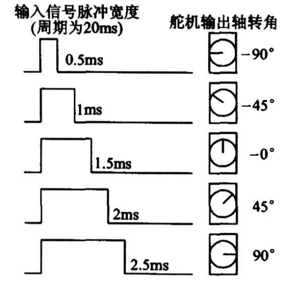

# 007.STM32F103C8T6_Output_Compare
&nbsp;&nbsp;PWM 实验

## PWM 控制舵机
&nbsp;&nbsp;舵机是一种根据输入PWM信号占空比来控制输出角度的装置。

&nbsp;&nbsp;输入PWM信号要求: 周期为20ms,高电平宽度为0.5ms ~ 2.5ms

### 舵机输出角度与输入信号脉冲关系

## PWM 控制电机
&nbsp;&nbsp;直流电机是一种将电能转换为机械能的装置，有两个电极，当电极正接时，电机正转，当电极反接时，电机反转

&nbsp;&nbsp;直流电机属于大功率器件，GPIO口无法直接驱动，需要配合电机驱动电路来操作

&nbsp;&nbsp;TB6612是一款双路H桥型的直流电机驱动芯片，可以驱动两个直流电机并且控制其转速和方向
