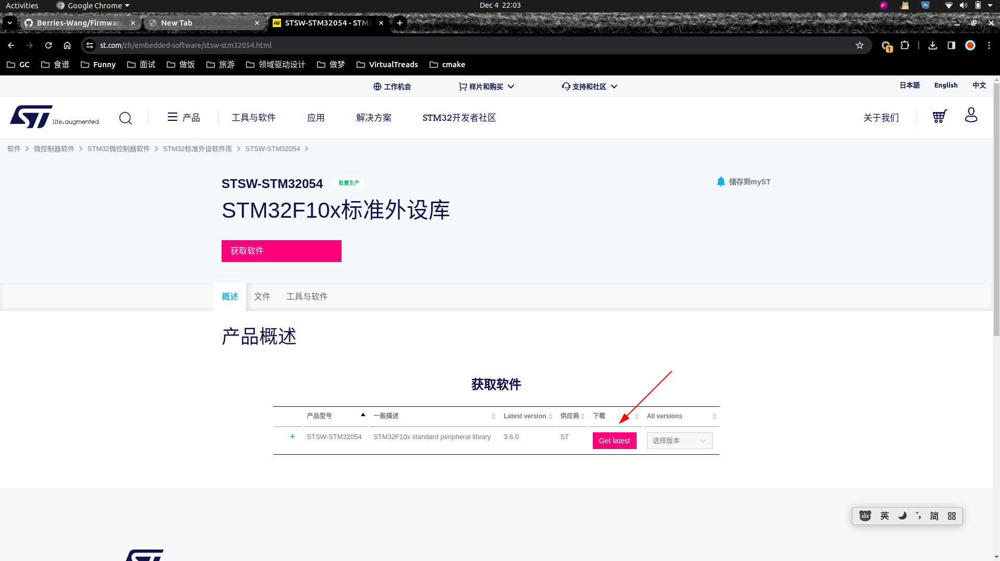

# STM32F103C8T6
&nbsp;&nbsp;STM32F103C8T6是一款由意法半导体公司（ST）推出的基于Cortex-M3内核的32位微控制器，硬件采用LQFP48封装。Cortex-M3是ARM公司推出的基于ARMv7架构的MCU内核，ST公司在此内核的基础上完成了USART、DMA、GPIO等外围电路的设计。

## 命名规则
STM32 F 103 C 8 T 6
- STM32: 基于ARM核心的32位微控制器
- F: 产品类型，F=通用型
- 103：产品子类型: 
  + 101: 基本型
  + 102: USB基本型,USB2.0全速设备
  + 103:增强型
  + 105/107: 互联型
- C：引脚数据: 引脚越多，外设也就越多
  + T:36脚
  + C：48脚
  + R： 64脚
  + V：100脚
  + Z：144脚
- 8：闪存存储器容量
  + 4: 16K字节的闪存存储器
  + 6: 32K字节的闪存存储器
  + 8: 64K字节的闪存存储器
  + B: 128K字节的闪存存储器
  + C: 256字节的闪存存储器
  + D: 384K字节的闪存存储器
  + E: 512K字节的闪存存储器
- T：封装:
  + H: BGA
  + T: LQFP
  + U: VFQFPN
  + Y: WLCSP64
- 6：温度范围:
  + 6: 工业级温度范围：-40摄氏度 ~ 85摄氏度
  + 7：工业级温度范围：-40摄氏度 ~ 105摄氏度

## 固件库下载
- [https://www.st.com/zh/embedded-software/stsw-stm32054.html](https://www.st.com/zh/embedded-software/stsw-stm32054.html)
   + 

&nbsp;&nbsp;那么启动文件，头文件，库函数，链接文件等资料都可以从这个包中获取，官网才是最好的文档。