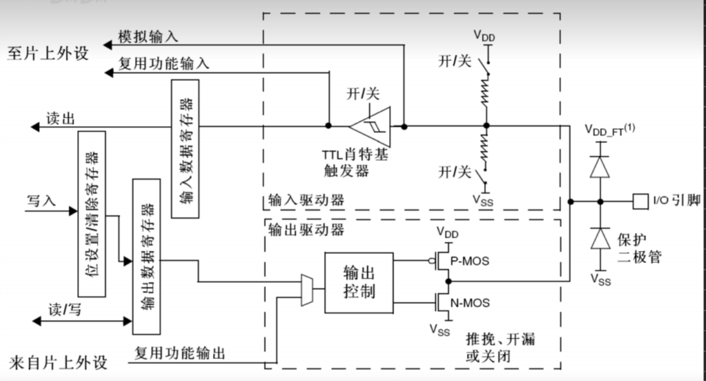
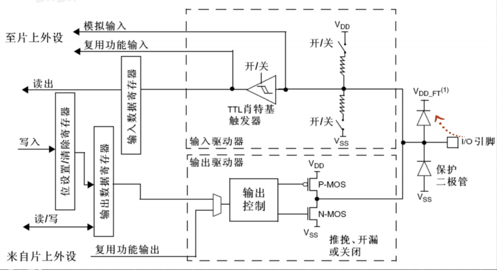
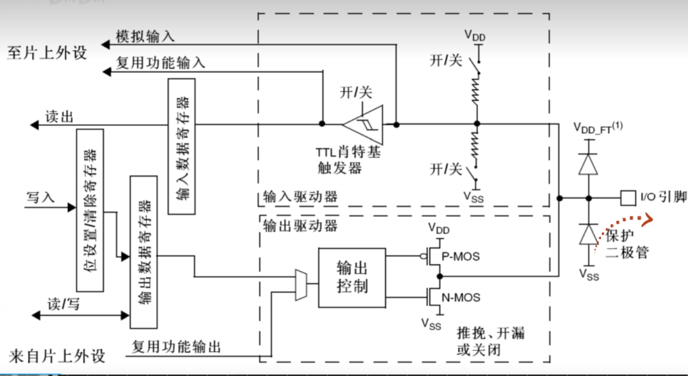
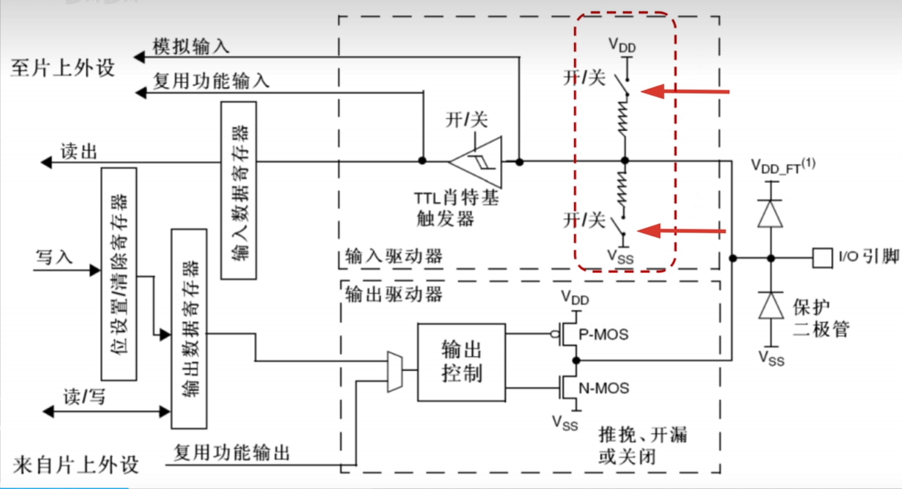

# GPIO(Geral Purpose Input Output GPIO) 通用目的输入输出端口
微控制器的数字输入输出模块，可以实现微控制器与外部设备的数字交换。借助GPIO，微控制器可以实现对外围设备最简单最直接的监控，且当微控制器没有足够的I/O引脚或片内存储器时，GPIO还可以实现串行和并行通信，存储器拓展等复用功能。

## GPIO内部结构

- VDD：D=device 表示器件的意思, 即器件内部的工作电压。VDD,英文全称为Virtual Device Driver(虚拟设备驱动)或Voltage Drain Drain(漏极电源电压),用作虚拟设备驱动时,可以看作为某一芯片内部的工作电压;用作漏极电源电压时,是指用于MOS晶体管电路,一般是指正电源。一般，电压可以统一用vdd作前缀。
- VSS： S=series 表示公共连接的意思，通常指电路公共接地端电压或电源负极，因此其代表地或者负极。或者这么说: VSS是源极电源电压，在CMOS电路中指负电源，在单电源时指零伏或接地。英文全称为: Voltage Source Supply。

GPIO 引脚电平： 0 ~ 3.3v,部分引脚可容忍5v

### 保护二极管 作用
用于防止外部过高、过低的电压输入而烧毁芯片（保证引脚电平在[ VSS , VDD ]之间）：
- 当引脚电压高于VDD时，上方二极管(VDD_FT(1))导通,电流不会进入到单片机内部，如下图:
  + 

- 当电压低于VSS时，下方二极管导通，电流流向如下图:
  + 

### 输入
如下图标出的两个开关可以编程控制，这两个上拉下拉电阻的目的是给单片机引脚确定一个电平，若外部没有接确定的电平，内部也没有上下拉（上拉电阻和下拉电阻没有闭合），引脚电平就会极易受到干扰，从而没有准确的电平。

1. 上面开关导通，下面开关断开，就是上拉输入模式，
    - 即接入上拉电阻，则引脚默认高电平
2. 上面开关断开，下面开关导通，就是上拉输入模式，
    - 即接入下拉电阻，则引脚默认低电平
3. 上下都断开，就是浮空输入模式
4. TTL 肖特基触发器
    - 作用是滤除电压的波动，经过这个触发器之后就将电压数据输入到寄存器中保存起来了，那么在程序中，只要读取该寄存器（输入数据寄存器）就可以知道电平的数据了。
5. 模拟输入: 接到ADC上，因为ADC需要模拟数据，所以就不需要触发器稳定电平，而直接接到触发器（TTL 肖特基触发器）前
6. 复用功能输入:提供给其他需要读取引脚电平外设使用的，如串口输入

### 输出
输出部分由两部分控制：1. 输出寄存器控制；2.外设复用控制; 两种方式通过数据选择器(输出驱动器虚线框内的“输出控制”)连接到引脚。

若选择输出寄存器控制，就是普通的IO口输出，程序写这个寄存器就可以操作IO口输出高低电平了，“位设置/清除寄存器” ，因为输出寄存器控制多个IO口输出，要想控制某个IO口，就需要这个位设置/清除寄存器，他可以设置/清除某一位，而不改变其他寄存器位。

#### 两个MOS管电子开关
可以通过编程方式将IO接到VDD还是VSS，有三种输出模式:
1. 推挽输出模式
    - P-MOS和N-MOS均有效：
       + 当输出寄存器为1时，代表要输出高电平，当“1”传输到输出控制处时，输出控制器控制P-MOS导通，N-MOS关闭，IO口就接到了VDD，也就是输出了高电平；
       + 当输出寄存器为0时，代表要输出低电平，当“0”传输到输出控制处时，输出控制器控制N-MOS导通，P-MOS关闭，IO口就接到了VSS，也就是输出了低电平；

2. 开漏输出模式
   - 开漏输出模式下，P-MOS会一直处于无效状态：
      + 当输出寄存器为1时，代表要输出高电平，当“1”传输到输出控制处时，输出控制器控制N-MOS关闭，此时输出相当于断开，也就是高阻模式，
      + 当输出寄存器为0时，代表要输出低电平，当“0”传输到输出控制处时，输出控制器控制N-MOS导通，P-MOS关闭，IO口就接到了VSS，也就是输出了低电平；
3. 输出关闭
   - 输出关闭模式下，P-MOS ， N-MOS均无效，也就是输出断开，即输出关闭

## 工作模式
详见: [基于STM32F103的GPIO详解.pdf](./005.DOCS/基于STM32F103的GPIO详解.pdf)

## 参考资料
1. [STM32单片机 GPIO工作模式小知识](https://www.bilibili.com/video/BV1dH4y1S76u/?spm_id_from=333.1007.top_right_bar_window_history.content.click&vd_source=9eef164b234175c1ae3ca71733d5a727)