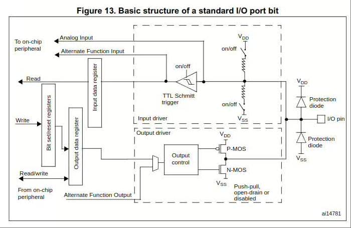

# GPIO 电路分析
> GPIO (General Purpose Input Output,通用输入输出口)

## APB2外设总线
在STM32中，所有的GPIO都是挂载在APB2外设总线上的，如图:([stm32f103c8.pdf](../../002.REF_DOCS/stm32f103c8.pdf)#`Figure 1. STM32F103xx performance line block diagram`)

内核可以通过APB2总线对GPIO模块内部的寄存器进行读写，这样就可以完成输出电平和读写电平的功能，寄存器的每一位对应一个引脚:向寄存器中对应的位写入1,那么对应的引脚就是高电平；如果输入时读取对应的寄存器位为1,那么此时对应的引脚输入的就是高电平；PS：1为高电平，0为低电平;)

---

## GPIO 模块

### GPIO 中`每一引脚（pin）`的具体电路结构 等效电路分析
> 等效电路如图:[rm0008-stm32f101xx-stm32f102xx-stm32f103xx-stm32f105xx-and-stm32f107xx-advanced-armbased-32bit-mcus-stmicroelectronics.pdf](../../002.REF_DOCS/rm0008-stm32f101xx-stm32f102xx-stm32f103xx-stm32f105xx-and-stm32f107xx-advanced-armbased-32bit-mcus-stmicroelectronics.pdf)#'Figure 13. Basic structure of a standard I/O port bit'

- 对于 Output data register 或 Input data register ，在这个电路中，只是操作寄存器中的某一位即可学习一下视频吧

#### Q&A
##### 1. 每个GPIO的pin都可以配置为不同模式的输入/输出吗?

#### GPIO引脚8种模式
> 学习:[rm0008-stm32f101xx-stm32f102xx-stm32f103xx-stm32f105xx-and-stm32f107xx-advanced-armbased-32bit-mcus-stmicroelectronics.pdf](../../002.REF_DOCS/rm0008-stm32f101xx-stm32f102xx-stm32f103xx-stm32f105xx-and-stm32f107xx-advanced-armbased-32bit-mcus-stmicroelectronics.pdf) & [STM32入门教程.pptx](../../002.REF_DOCS/STM32入门教程.pptx) 内包含了各种模式的电路结构和原理

##### Input mode configuration (输入模式)
###### 上拉输入
###### 下拉输入
###### 浮空输入

---

##### Output mode configuration(输出模式)
###### 推挽输出（Push-pull output mode）
###### 开漏输出（Open-drain output mode）

---

##### Alternate functions（复用功能）

---

##### Analog configuration (模拟配置)

---

## 参考资料
- [rm0008-stm32f101xx-stm32f102xx-stm32f103xx-stm32f105xx-and-stm32f107xx-advanced-armbased-32bit-mcus-stmicroelectronics.pdf](../../002.REF_DOCS/rm0008-stm32f101xx-stm32f102xx-stm32f103xx-stm32f105xx-and-stm32f107xx-advanced-armbased-32bit-mcus-stmicroelectronics.pdf)
- [stm32f103c8.pdf](../../002.REF_DOCS/stm32f103c8.pdf)