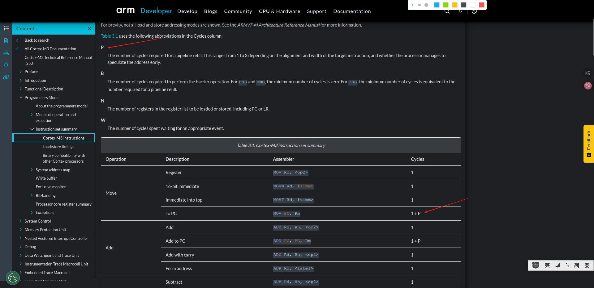
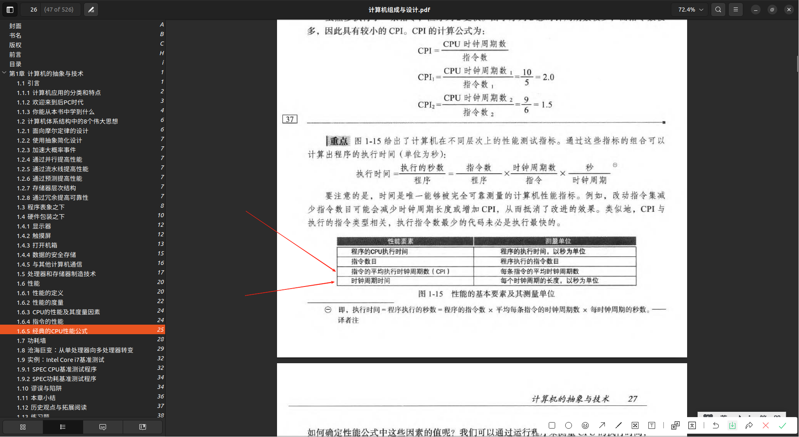

# 时钟频率与指令周期与指令执行

## 先了解一些概念
### Instruction Cycle(指令周期)
CPU从获取到完整执行一条指令所需的全部时间
 - [奔跑吧Linux内核（第2版）卷1：基础架构] 提到 ‘经典处理器架构的流水线是5级流水线，分别是取指、译码、执行、数据内存访问和写回’，指令周期描述的就是这流水线完成所需要的时间不是描述的某一个阶段，因为需要提升的是CPU执行速度，而不是提升某一个阶段的速度
 - 在 [奔跑吧Linux内核（第2版）卷1：基础架构]搜索并阅读 ‘周期’相关内容中又提到 “超标量架构：早期的单发射架构微处理器的流水线设计目标是做到平均每个时钟周期能执行一条指令，” 结合图“[图1.2　Cortex-A9处理器的内部架构]”来理解 “平均每个时钟周期能执行一条指令”：
   + ”`平均`“是什么意思呢？因为是流水线并行执行的，可能同时执行多条CPU指令，但是指令在不同阶段，所以平均在这个地方
   + 结合理解 [计算机组成与设计 硬件/软件接口#1.6.4 指令的性能 & 1.6.5 经典的 CPU 性能公式](../../002.REF_DOCS/计算机组成与设计-硬件-软件_接口/计算机组成与设计-pages-1.pdf):中的CPICPI (Clock cycles Per Instruction) 表示执行每条指令所需的平均时钟周期数，那么就可以将CPI理解为就是单条指令所需要的时钟周期了。
-  在[Cortex-M3 Technical Reference Manual](../../002.REF_DOCS/DDI0337H_cortex_m3_r2p0_trm.pdf)
   + 如图，指令周期所消耗的时钟周期还受其他因素影响。

### 时钟频率
时钟频率是CPU的“心跳”或“节奏”。它由主板上的一个晶体振荡器产生，是一个持续、稳定、快速的脉冲信号。
单位：赫兹，即每秒的周期数频率和时钟周期互成倒数。例如 2.5 GHz 表示每秒有25亿个时钟周期。

---

## Q&A
### 1. CPU的时钟频率变了，那指令所需的周期数会变吗
**不会变**

指令所需的时钟周期数（Clock Cycles Per Instruction, CPI）是由CPU的微架构（Microarchitecture）决定的，而时钟频率（Clock Rate）是CPU执行这个微架构的节奏。改变节奏不会改变完成一个动作（指令）本身所需的步骤数

> 通过阅读: [什么是时钟速度？](./999.IMGS/Screenshot%202025-11-01%20at%2000-00-09%20What%20Is%20Clock%20Speed.png) & [What Is Clock Speed?](./999.IMGS/Screenshot%202025-11-01%20at%2000-02-06%20CPU%20What%20Is%20Clock%20Speed.png) & [Table 3-1 Cortex-M3 instruction set summary](./../../002.REF_DOCS/DDI0337H_cortex_m3_r2p0_trm.pdf)  
& [Exec  Latency:值的单位就是时钟周期](./../../002.REF_DOCS/Cortex_A57_Software_Optimization_Guide_external.pdf) & 在 [奔跑吧Linux内核（第2版）卷1：基础架构] 提到:
-  大部分简单指令能在一个周期内完成，符合这种情况的指令集叫作精简指令集计算机（Reduced Instruction Set Computer，RISC）指令集，以前的指令集叫作复杂指令集计算机（Complex Instruction Set Computer，CISC）指令集
- 超标量架构：早期的单发射架构微处理器的流水线设计目标是做到平均每个时钟周期能执行一条指令，但这一目标不能满足提高处理器性能的要求。为了提高处理器的性能，处理器要具有每个时钟周期发射执行多条指令的能力。超标量体系结构可描述一种微处理器设计理念，它能够让处理器在一个时钟周期执行多条指令。
- 2005年发布的Cortex-A8内核是第一个引入超标量技术的ARM处理器，它在每个时钟周期内可以并行发射两条指令，但依然使用静态调度的流水线和顺序执行方式。

通过这些资料，可以知道，CPU 指令的执行时间的单位是 **时钟周期** ,并不是时/分/秒/毫秒/微秒/纳秒...

再通过资料[计算机组成与设计 硬件/软件接口#1.6.4 指令的性能 & 1.6.5 经典的 CPU 性能公式](../../002.REF_DOCS/计算机组成与设计-硬件-软件_接口/计算机组成与设计-pages-1.pdf):进行推断，进一步证明CPU指令的执行时间单位是 **时钟周期** ,并不是时/分/秒/毫秒/微秒/纳秒... ， 而时钟周期=1/时钟频率，对于STM32F103C8T6时，时钟周期 = 1/72MHZ = 13.89ns约等于,即，在时钟频率为72MHZ的情况下，单个时钟周期约为13.89ns

在上述资料中，得到 CPU指令执行时间单位是 **时钟周期** ， 并不是传统的时间单位: 时/分/秒/毫秒/微秒/纳秒... 

### 2. 为什么提升系统频率，CPU性能会提升呢?
结合上述材料，得出进一步的结论： 当提升系统时钟频率，会降低单个时钟周期所对应的时间，那么在相同时间内，高频率会执行更多CPU指令，则CPU性能更高。

### 3. CPU频率越高，CPU性能越强?
**不是**,因为较新架构的CPU处理指令的效率可能更高，还是得比较同一CPU品牌的同一代

阅读 [什么是时钟速度？](./999.IMGS/Screenshot%202025-11-01%20at%2000-00-09%20What%20Is%20Clock%20Speed.png) & [What Is Clock Speed?](./999.IMGS/Screenshot%202025-11-01%20at%2000-02-06%20CPU%20What%20Is%20Clock%20Speed.png)

- Sometimes, multiple instructions are completed in a single clock cycle; in other cases, one instruction might be handled over multiple clock cycles. Since different CPU designs handle instructions differently, it’s best to compare clock speeds within the same CPU brand and generation.(有时，多个指令在单个时钟周期内完成;在其他情况下，一条指令可能会在多个时钟周期内处理。由于不同的 CPU 设计处理指令的方式不同，因此最好比较同一 CPU 品牌和一代的时钟速度。)

- For example, a CPU with a higher clock speed from five years ago might be outperformed by a new CPU with a lower clock speed, as the newer architecture deals with instructions more efficiently.(例如，五年前时钟速度较高的 CPU 可能会被时钟速度较低的新 CPU 超越，因为较新的架构可以更有效地处理指令。)

---

## 参考资料
- [什么是时钟速度？](https://www.intel.cn/content/www/cn/zh/gaming/resources/cpu-clock-speed.html)
- [What Is Clock Speed?](https://www.intel.com/content/www/us/en/gaming/resources/cpu-clock-speed.html)

