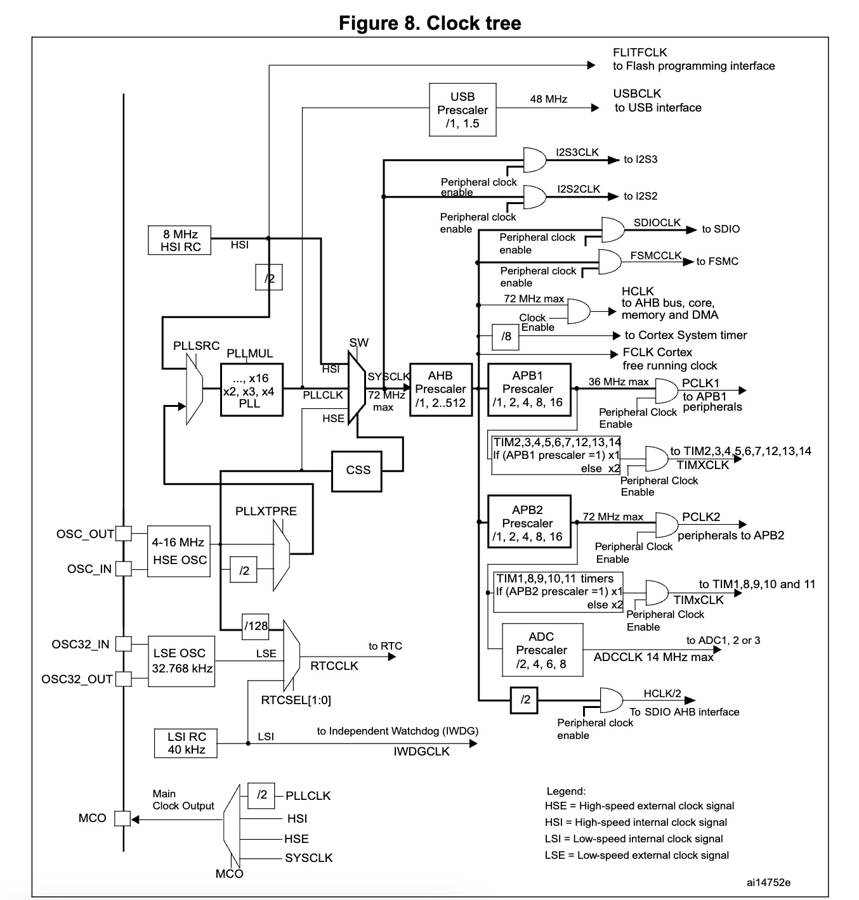

# RCC (Reset and Clock Control.复位和时钟控制)
## 摘要
- STM32时钟系统主要的目的就是给相对独立的外设模块提供时钟，也是为了降低整个芯片的耗能。
- 系统时钟，是处理器运行时间基准（每一条机器指令一个时钟周期）
- 时钟是单片机运行的基础，时钟信号推动单片机内各个部分执行相应的指令。
- 一个单片机内提供多个不同的系统时钟，可以适应更多的应用场合。
- 不同的功能模块会有不同的时钟上限，因此提供不同的时钟，也能在一个单片机内放置更多的功能模块。
-  对不同模块的时钟增加开启和关闭功能，可以降低单片机的功耗
- STM32为了低功耗，他将所有的外设时钟都设置为disable(不使能)，用到什么外设，只要打开对应外设的时钟就可以， 其他的没用到的可以还是disable(不使能)，这样耗能就会减少。  这就是为什么不管你配置什么功能都需要先打开对应的时钟的原因

## Clock Tree 解析
