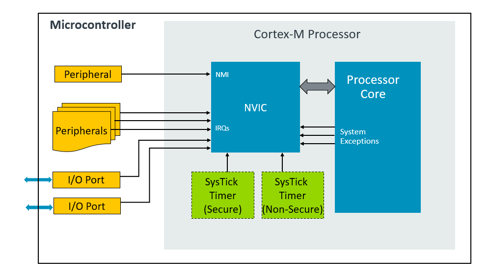
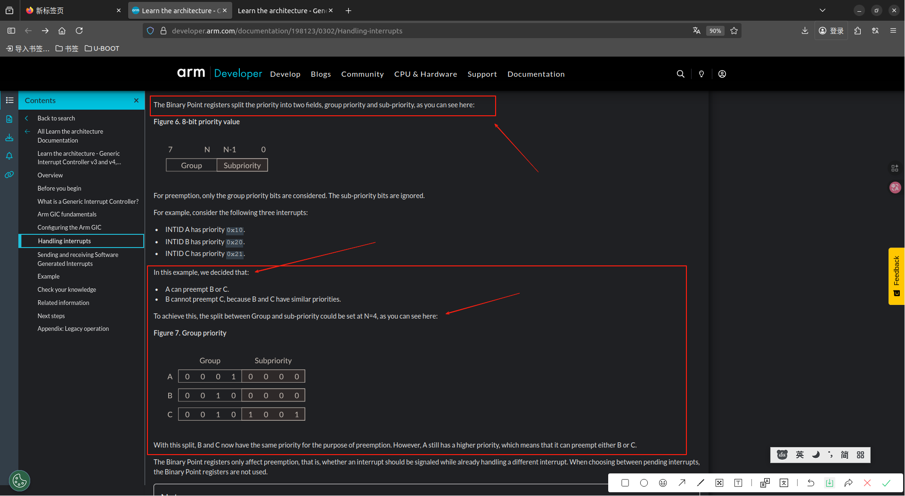

# NVICNested Vectored Interrupt Controller
学习: [Armv8-M Exception Model User Guide#NVIC registers for interrupt management](../../002.REF_DOCS/armv8-m_exception_model_user_guide_107706_0100_01_en.pdf)  & [Armv8-M Exception Model User Guide#SCB registers for system exception management](../../002.REF_DOCS/armv8-m_exception_model_user_guide_107706_0100_01_en.pdf) 
- NVIC 功能有哪些
- 如何通过控制寄存器来配置NVIC : 开启/关闭 , 配置异常优先级 、清除中断状态

## NVIC 是什么，有什么功能
The NVIC is responsible for deciding which code stream the processor should be executing at any given time. It is also responsible for managing the current execution priority and the priorities assigned to all exception types. For most exceptions, the NVIC also takes care of whether each individual exception is enabled or not. Some exceptions are always enabled.(NVIC（嵌套向量中断控制器）负责决定处理器在任何给定时刻应执行哪段代码流。它同时负责管理当前的执行优先级以及分配给所有异常类型的优先级。对于大多数异常，NVIC还会处理每个独立异常的启用或禁用状态，但某些异常始终处于启用状态。)

## NVIC 实践
得结合NVIC配置代码 [000.STM32/000.STM32F103C8T6/000.STM32F103C8T6_1/002.BASE_LIBS/STM32_Driver/misc.h](../../000.STM32/000.STM32F103C8T6/000.STM32F103C8T6_1/002.BASE_LIBS/STM32_Driver/misc.h) 来分析

### void NVIC_SetPriority (IRQn_Type IRQn, uint32_t priority)
在本仓库中，阅读一下这个代码，查看 IRQn_Type 枚举值，再结合Cortex-M的异常优先级，发现： 异常优先级是可以重新定义的

## Priority grouping 这个很重要，涉及参数配置： 组优先级决定是否可以被抢占，子优先级决定执行顺序(不能被抢占，哪怕后面的中断子优先级更高)
> 学习:[Armv8-M Exception Model User Guide#2.3.1 Priority grouping](../../002.REF_DOCS/armv8-m_exception_model_user_guide_107706_0100_01_en.pdf)

The priority grouping feature allows exceptions with similar priorities to be grouped together. An exception will only pre-empt if it is in a higher priority group than the current execution priority. By increasing the size of the priority groups, software can reduce the maximum exception nesting depth, and therefore stack usage, but at the cost of increasing the latency of some exceptions.(优先级分组功能允许将具有相似优先级的异常分组在一起。只有当异常位于比当前执行优先级更高的优先级组时，才会发生异常抢占。通过增大优先级组的范围，软件可以减少最大异常嵌套深度，从而降低栈内存使用量，但代价是会增加某些异常的响应延迟)是否可以被抢占是根据优先级组来比较的，而不是异常优先级

For processors based on Armv7-M or Armv8-M architecture, the chip designer can define a hardware configuration so that all 8 bits are implemented in the priority level registers. However, instead of having the maximum of 256 pre-emption levels, the maximum number of pre-emption levels are limited to 128. This is because of the fact that 8-bit priority level registers are further divided into two halves:(对于基于 Armv7-M 或 Armv8-M 架构的处理器，芯片设计师可以定义一种硬件配置，使优先级级别寄存器完整实现 8 位。然而，抢占级别的最大数量并非达到 256 级，而是被限制为 128 级。这是因为 8 位优先级寄存器被进一步划分为两个部分：)
- The upper half (left bits) is the group priority for the pre-emption control.(上半部分（左侧的比特位）是用于抢占控制的组优先级)
  + The group priority level defines whether an interrupt can be handled when the processor is already running another interrupt handler.(组优先级决定了当处理器已在执行另一个中断处理程序时，当前中断是否能够被处理。即是否能被抢占)

- The lower half (right bits) is the subpriority
  + The subpriority level is only used when two exceptions with the same group priority level occur at the same time. In this situation, the exception with higher subpriority, that is the lower value, is handled first.（子优先级仅当两个具有相同组优先级的异常同时发生时才会被使用。在这种情况下，子优先级更高（即数值更小）的异常将优先得到处理按照子优先级顺序，不会被抢占，哪怕后面的中断子优先级更高）

The dividing line between group priority and subpriority bits, called the binary point, is programmed by setting the AIRCR.PRIGROUP field. The PRIGROUP encoding is as follows:(组优先级与子优先级位之间的分界线被称为二进制点，可通过配置AIRCR.PRIGROUP字段进行设置。PRIGROUP的编码方式如下：)
|PRIGROUP Group| priority . Subpriority|
|-|-|
|3'b000| ggggggg . s|
|3'b001| gggggg . ss|
|3'b010| ggggg . sss|
|3'b011| gggg . ssss|
|3'b100| ggg . sssss|
|3'b101| gg . ssssss|
|3'b110| g . sssssss|
|3'b111| . ssssssss |

There is no PRIGROUP encoding that results in all eight bits being treated as group priority. The maximum number of levels of nesting is limited to the fixed level exceptions HardFault and NMI, plus a number of programmable group priorities. Since PRIGROUP is architecturally limited to seven bits of group priority, the number of programmable priorities can never be more than 128.(不存在任何PRIGROUP编码能将全部8个比特位配置为组优先级。最大嵌套层数受限于固定优先级异常（HardFault与NMI），外加可编程组优先级的数量。由于PRIGROUP在架构上被限制为7位组优先级，可编程优先级的数量永远不可能超过128级)

## PriorityGroup & SubPriority: 参考一下GIC
> 参考:[Learn the architecture - Generic Interrupt Controller v3 and v4##Running priority and preemption](../../002.REF_DOCS/learn_the_architecture_-_generic_interrupt_controller_v3_and_v4__overview_198123_0302_03_en-1.pdf)

