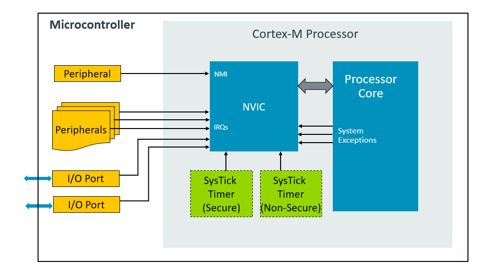

# NVICNested Vectored Interrupt Controller
学习: [Armv8-M Exception Model User Guide#NVIC registers for interrupt management](../../002.REF_DOCS/armv8-m_exception_model_user_guide_107706_0100_01_en.pdf)  & [Armv8-M Exception Model User Guide#SCB registers for system exception management](../../002.REF_DOCS/armv8-m_exception_model_user_guide_107706_0100_01_en.pdf) 
- NVIC 功能有哪些
- 如何通过控制寄存器来配置NVIC : 开启/关闭 , 配置异常优先级 、清除中断状态

## NVIC 是什么，有什么功能
The NVIC is responsible for deciding which code stream the processor should be executing at any given time. It is also responsible for managing the current execution priority and the priorities assigned to all exception types. For most exceptions, the NVIC also takes care of whether each individual exception is enabled or not. Some exceptions are always enabled.(NVIC（嵌套向量中断控制器）负责决定处理器在任何给定时刻应执行哪段代码流。它同时负责管理当前的执行优先级以及分配给所有异常类型的优先级。对于大多数异常，NVIC还会处理每个独立异常的启用或禁用状态，但某些异常始终处于启用状态。)

## NVIC 实践
得结合NVIC配置代码 [000.STM32/000.STM32F103C8T6/000.STM32F103C8T6_1/002.BASE_LIBS/device_libs/core_cm3.h](../../000.STM32/000.STM32F103C8T6/000.STM32F103C8T6_1/002.BASE_LIBS/device_libs/core_cm3.h) & [000.STM32/000.STM32F103C8T6/000.STM32F103C8T6_1/002.BASE_LIBS/device_libs/core_cm3.c](../../000.STM32/000.STM32F103C8T6/000.STM32F103C8T6_1/002.BASE_LIBS/device_libs/core_cm3.c) 来分析

### void NVIC_SetPriority (IRQn_Type IRQn, uint32_t priority)
在本仓库中，阅读一下这个代码，查看 IRQn_Type 枚举值，再结合Cortex-M的异常优先级，发现： 异常优先级是可以重新定义的