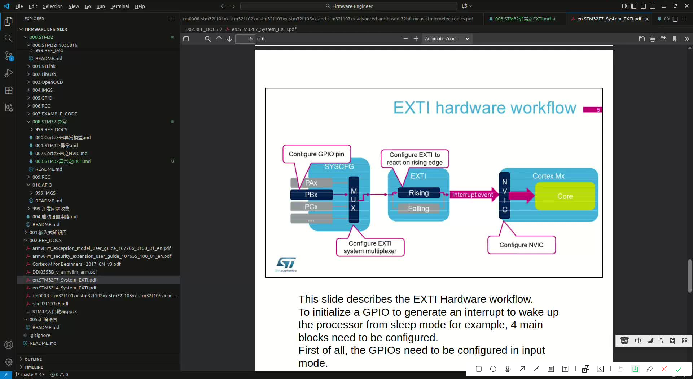
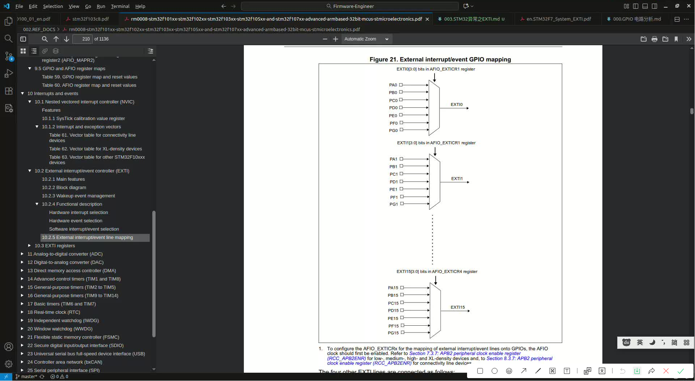

# EXTI (External interrupt/event controller )
学习  [RM0008 Reference manual: STM32F101xx, STM32F102xx, STM32F103xx, STM32F105xx and STM32F107xx advanced Arm®-based 32-bit MCUs#10.2 External interrupt/event controller (EXTI)](../../002.REF_DOCS/rm0008-stm32f101xx-stm32f102xx-stm32f103xx-stm32f105xx-and-stm32f107xx-advanced-armbased-32bit-mcus-stmicroelectronics.pdf)，需要理解图 ‘Figure 20. External interrupt/event controller block diagram’ ， 以下几个名词得了解:
- 上升沿触发
- 下降沿触发

### EXTI Hardware workflow （EXTI硬件工作流程）
- 

如上图，来自于 [002.REF_DOCS/en.STM32F7_System_EXTI.pdf](../../002.REF_DOCS/en.STM32F7_System_EXTI.pdf) , 这个文档主要讲述的是使用EXTI来完成对在睡眠模式(Sleep Mode)的处理器(processor)进行唤醒 —— GPIO口产生中断  , 内含详细的配置流程。

这个图是 STM32F7的流程图，STM32F103C8T6大体和他一直，不同之处在于 'EXTI System Multiplexer（EXTI系统复用器）' , 在 STM32F103C8T6 中，则是 通过控制 AFIO_EXTICR1寄存器 来实现的，因此，在 STM32F103C8T6 则是配置AFIO。
- STM32F103C8T6 查阅 [RM0008 Reference manual: STM32F101xx, STM32F102xx, STM32F103xx, STM32F105xx and STM32F107xx advanced Arm®-based 32-bit MCUs#10.2.5 External interrupt/event line mapping](../../002.REF_DOCS/rm0008-stm32f101xx-stm32f102xx-stm32f103xx-stm32f105xx-and-stm32f107xx-advanced-armbased-32bit-mcus-stmicroelectronics.pdf)

### 10.2.5 External interrupt/event line mapping
学习 [RM0008 Reference manual: STM32F101xx, STM32F102xx, STM32F103xx, STM32F105xx and STM32F107xx advanced Arm®-based 32-bit MCUs#10.2 External interrupt/event controller (EXTI)](../../002.REF_DOCS/rm0008-stm32f101xx-stm32f102xx-stm32f103xx-stm32f105xx-and-stm32f107xx-advanced-armbased-32bit-mcus-stmicroelectronics.pdf) ， 描述了如何将112不是C8T6,是其他更多引脚的Cortex-M芯片个GPIO口映射到16外部中断线中
- 