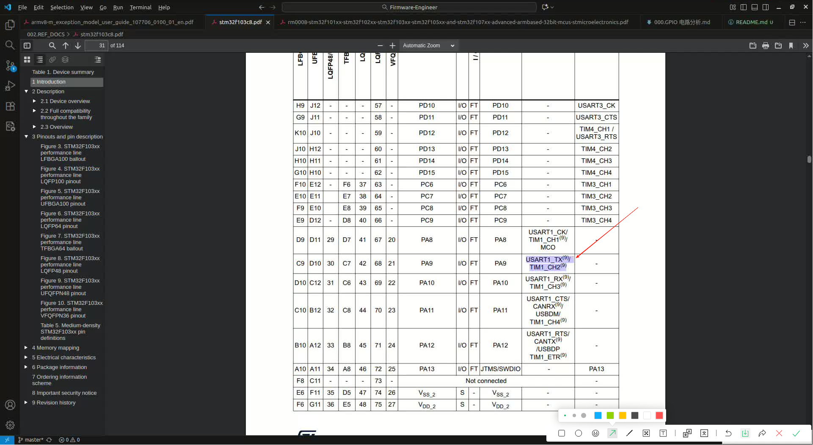
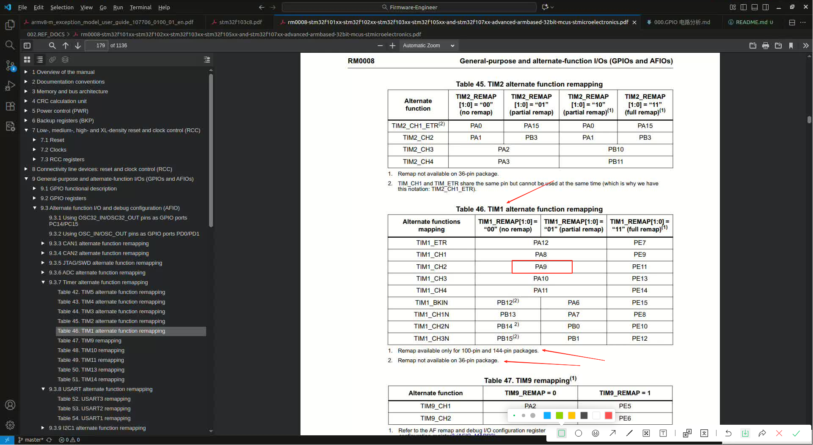
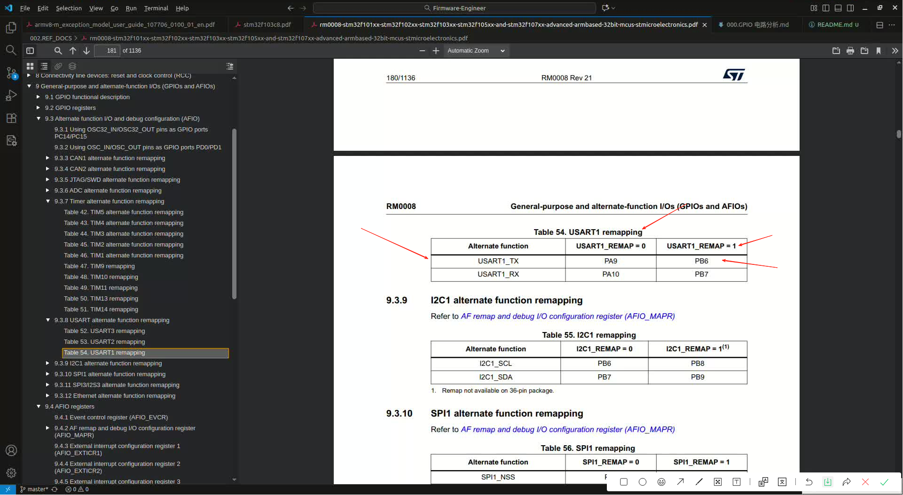

# AFIO(Alternate Function I/O. 复用功能I/O)
To optimize the number of peripherals available for the 64-pin or the 100-pin or the 144-pin package, it is possible to remap some alternate functions to some other pins.(为了优化64引脚、100引脚或144引脚封装可用的外设数量，可以`将某些复用功能重新映射到其他引脚上`。注意!!! 当两个功能都需要使用同一个物理引脚，然此时这两个功能需要同时使用，那么此时就会引脚冲突，此时就需要查手册，将其中的一个功能锁使用的引脚`重映射`到其他引脚上，这就是AFIO)
- [RM0008 Reference manual: STM32F101xx, STM32F102xx, STM32F103xx, STM32F105xx and STM32F107xx advanced Arm®-based 32-bit MCUs#9.3 Alternate function I/O and debug configuration (AFIO)](../../002.REF_DOCS/rm0008-stm32f101xx-stm32f102xx-stm32f103xx-stm32f105xx-and-stm32f107xx-advanced-armbased-32bit-mcus-stmicroelectronics.pdf)

## 举例说明
##### 1. PA9
如下图，PA9 可用于 USART1_TX(9)/TIM1_CH2(9)，如果同时用于 USART1_TX(9) 和 TIM1_CH2(9)，那么就只能将其中一个功能映射到其他引脚上去了
- 

此时，就得将其中一个功能重映射到另外一个引脚上，查看手册:

能不能将TIM1_CH2重映射到其他引脚？ 答案是不能
- 
  + 如图，当前设备是STM32F103C8T6,只有64个引脚，因此无法将PA9重映射到其他引脚。
  + [RM0008 Reference manual: STM32F101xx, STM32F102xx, STM32F103xx, STM32F105xx and STM32F107xx advanced Arm®-based 32-bit MCUs#Table 46. TIM1 alternate function remapping](../../002.REF_DOCS/rm0008-stm32f101xx-stm32f102xx-stm32f103xx-stm32f105xx-and-stm32f107xx-advanced-armbased-32bit-mcus-stmicroelectronics.pdf)

能不能将USART1_TX映射到其他引脚? 可以，查看手册
- 
   + [RM0008 Reference manual: STM32F101xx, STM32F102xx, STM32F103xx, STM32F105xx and STM32F107xx advanced Arm®-based 32-bit MCUs#Table 54. USART1 remapping](../../002.REF_DOCS/rm0008-stm32f101xx-stm32f102xx-stm32f103xx-stm32f105xx-and-stm32f107xx-advanced-armbased-32bit-mcus-stmicroelectronics.pdf)
   + 通过查询手册，可以发现，将 USART1_REMAP = 1 , 那么就可以将 USART1_TX 从PA9重映射到PB6上
