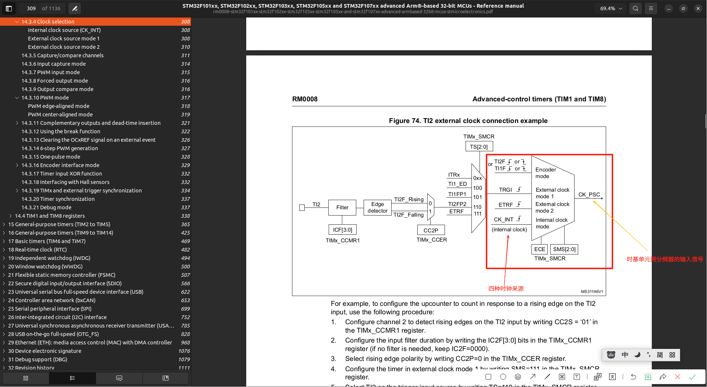

# 14.3.4 Clock selection 时钟来源选择
> 阅读:[14.3.4 Clock selection](../../../002.REF_DOCS/rm0008-stm32f101xx-stm32f102xx-stm32f103xx-stm32f105xx-and-stm32f107xx-advanced-armbased-32bit-mcus-stmicroelectronics.pdf)

- TI2F： Timer Input 2 Filtered ， TI2 是指定时器的通道 2 输入引脚（例如 TIMx_CH2）； F 表示该信号经过了输入滤波器。

## 如上图，时基单元的输入有四种，即 时钟来源有四种:
### 来源1： Internal clock source (CK_INT) 即 内部RCC，图中的CK_INT

### 来源2：External clock source mode 1 

### 来源3： External clock source mode 2 
- 直接将 TIM1_ETR 引脚上的外部脉冲作为定时器TIM1的时钟源。定时器的计数器（CNT）会在每个有效的ETR边沿进行计数 

### 来源4： Using one timer as prescaler for another timer 延长定时周期，实现超长定时或复杂波形
> 参考:[15.3.15 Timer synchronization](../../../002.REF_DOCS/rm0008-stm32f101xx-stm32f102xx-stm32f103xx-stm32f105xx-and-stm32f107xx-advanced-armbased-32bit-mcus-stmicroelectronics.pdf)

