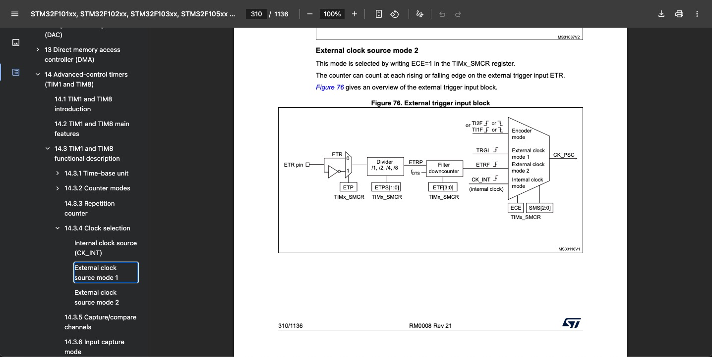

# 14.3.4 Clock selection 时钟来源选择
> 阅读:[14.3.4 Clock selection](../../../002.REF_DOCS/rm0008-stm32f101xx-stm32f102xx-stm32f103xx-stm32f105xx-and-stm32f107xx-advanced-armbased-32bit-mcus-stmicroelectronics.pdf)

## 如上图，时基单元的输入有四种，即 时钟来源有四种:
### 来源1： Internal clock source (CK_INT) 即 内部RCC，图中的CK_INT

### 来源2：External clock source mode 1 

- TI2F： Timer Input 2 Filtered ， TI2 是指定时器的通道 2 输入引脚（例如 TIMx_CH2）； F 表示该信号经过了输入滤波器。‘ 多功能IO引脚 输入捕获、输出比较、PWM生成、**外部时钟/触发**

### 来源3： External clock source mode 2
-  
- 直接将 TIM1_ETR 引脚上的外部脉冲作为定时器TIM1的时钟源。定时器的计数器（CNT）会在每个有效的ETR边沿进行计数 --- 对应 图[Figure 76. External trigger input block]中的ETR pin,参考STM32手册[stm32f103c8.pdf](../../../002.REF_DOCS/stm32f103c8.pdf)中的‘TIM1_ETR’,是一个输入引脚
  + TIM1_ETR 是 高级控制定时器1 (TIM1) 的专用外部触发引脚 外部时钟/触发
     - TIM1：STM32中功能最强大的高级控制定时器，通常用于电机控制、数字电源和复杂PWM应用。
     - ETR：External Trigger（外部触发）的缩写。
     - 物理属性：它是一个具体的物理引脚, TIM1_ETR 是一个输入引脚，其核心功能是从一个专用的外部源，向TIM1内部引入一个高度可控的信号，用以驱动、同步或控制整个定时器的行为。

### 来源4： Using one timer as prescaler for another timer 延长定时周期，实现超长定时或复杂波形
> 参考:[15.3.15 Timer synchronization](../../../002.REF_DOCS/rm0008-stm32f101xx-stm32f102xx-stm32f103xx-stm32f105xx-and-stm32f107xx-advanced-armbased-32bit-mcus-stmicroelectronics.pdf)

