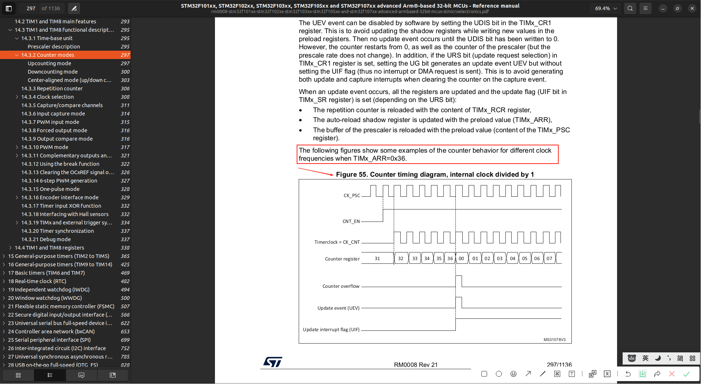

# Time Base Unit (时基单元)
学习 [[STM32 HAL库][定时器]时基单元，最佳教程，没有之一~](../999.IMG/1593167269-1-192.mp4)  & [[定时器]时基单元(补充)，最佳教程，没有之一~](../999.IMG/1597015420-1-192.mp4)

- 分频(降频): 分频后频率 = 输入频率 / (${PSC} + 1); 为什么+1,因为计数是从0开始的
- 计数器： 对输入脉冲进行计数，每计满一个定时周期就溢出一次
- 重复计数（RCR）： 每当计数器CNT溢出一次，重复计数RCR就会+1,当重复计数值达到(${RCR}+1)为什么+1,因为计数是从0开始的，那么就会产生update事件。 
- 图中阴影是“shadow register”(影子寄存器)视频中详细说明了其功能,其功能是寄存器的预加载功能,在某个事件中替换活动寄存器的值--防止跑飞
- The prescaler can divide the counter clock frequency by any factor between 1 and 65536. It is based on a 16-bit counter controlled through a 16-bit register (in the TIMx_PSC register). It can be changed on the fly as this control register is buffered. The new prescaler ratio is taken into account at the next update event.（预分频器可以将计数器时钟频率进行1至65536之间的任意倍数分频。该功能基于一个由16位寄存器（即TIMx_PSC寄存器）控制的16位计数器实现。由于控制寄存器具有缓冲机制，其数值可实时动态调整，而新的预分频比例将在下次更新事件发生时生效。）

## 手册中的时基单元
> [Figure 52. Advanced-control timer block diagram](../../../002.REF_DOCS/rm0008-stm32f101xx-stm32f102xx-stm32f103xx-stm32f105xx-and-stm32f107xx-advanced-armbased-32bit-mcus-stmicroelectronics.pdf)

+ TIMx_CH1 是什么?
  - TIMx：代表一个具体的定时器外设，例如 TIM1, TIM2, TIM3, ..., TIM14。
  - CHy：代表该定时器的通道y，其中 y 可以是 1, 2, 3, 4。高级定时器（如TIM1/TIM8）有4个通道，通用定时器（如TIM2-TIM5）通常也有4个，而基本定时器（如TIM6/TIM7）则没有通道 , 因此，例如 TIMx_CH1 就是 定时器 x 的通道 1 所对应的物理引脚
+ TI1FP1： Timer Input 1，即定时器的通道1输入引脚（例如 TIMx_CH1）；FP：Filtered and Polarity，表示该信号经过了滤波和极性选择；1：代表它被路由到定时器内部的第一组逻辑单元（如触发输入、从模式控制器等）

The time-base unit includes:
- Counter register (TIMx_CNT)
- Prescaler register (TIMx_PSC)
- Auto-reload register (TIMx_ARR)
- Repetition counter register (TIMx_RCR)

The update event is sent when the counter reaches the overflow (or underflow when downcounting) and if the UDIS bit equals 0 in the TIMx_CR1 register. It can also be generated by software

## 如何理解 'Figure 53. Counter timing diagram with prescaler division change from 1 to 2'计数器时序图：预分频器分频比从1变为2时的变化
> 这个得学完时基单元的视频教程再来分析

- CK_PSC： 看上图`Figure 52. Advanced-control timer block diagram` , 这个CK_PSC是时基单元预分频器的输入，
- CEN： 'Enable the counter by setting the CEN bit in the TIMx_CR1 register.'资料中的原文,即 当CEN=1时，计数器才会开启
  + The counter is clocked by the prescaler output CK_CNT, which is enabled only when the
counter enable bit (CEN) in TIMx_CR1 register is set （计数器由预分频器输出 CK_CNT 提供时钟， 仅当 TIMx_CR1 寄存器中的计数器使能位 (CEN) 被置 1 时， 该时钟才被使能。）
- Timerclock = CK_CNT： 这个是预分频器的输出，计数器(CNT)的输入
  + CK_CNT = CK_PSC / (1 + (TIMx_PSC))
  + 所以，这张图描述的是预分频器的值由0变为1的过程。
- Counter register(TIMx_CNT): 存储的是${CNT} ， CK_CNT 来一次脉冲，TIMx_CNT就会+1,直到大于等于ARR的值（溢出），此时会产生一次输入给RCR, 然后TIMx_CNT继续从0开始，周而复始...
- Update event (UEV)： 更新事件，当可重复计数器的值溢出，则会产生一次Update中断或者事件。
- Prescaler control register ： 预分频器控制寄存器，就是时基单元中的 (TIMx_PSC) 。
- Prescaler buffer： 这应该就是类似于视频中的 影子寄存器，避免跑飞计数器的值大于阈值——不会立即生效，需要等到下一次事件产生的时候生效。本文搜索'The auto-reload shadow register is updated' 对比学习  
  + 'Prescaler buffer' 在 ·Upcounting mode (向上计数模式)· 中有介绍
- Prescaler counter： 预分频器内部的一个计数器，是预分频器的核心组成部分，即 记满一个数(${TIMx_PSC})，则产生一次CK_CNT信号
- TIMx_PSC 更新之前，CK_PSC 一次脉冲对应着一次CK_CNT脉冲，当TIMx_PSC更新为1生效的时候，两次CK_PSC脉冲对应着一次CK_CNT脉冲

---

## Counter modes (计数器模式)
### Upcounting mode (向上计数模式)1: UEV如何产生的?
In upcounting mode, the counter counts from 0 to the auto-reload value (content of the
TIMx_ARR register), then restarts from 0 and generates a counter overflow event.在向上计数模式下，计数器从0递增至自动重载值（即TIMx_ARR寄存器的数值），随后从0重新开始计数，并产生一个计数器溢出事件。,结合手册中的 图`Figure 52. Advanced-control timer block diagram`中的时基单元 和 下图 `igure 55. Counter timing diagram, internal clock divided by 1` 来分析

If the repetition counter is used, the update event (UEV) is generated after upcounting is repeated for the number of times programmed in the repetition counter register plus one (TIMx_RCR+1). Else the update event is generated at each counter overflow.(**若启用重复计数器，更新事件(UEV)将在向上计数重复执行「重复计数器寄存器设定值加1」(TIMx_RCR+1)次后产生；否则，更新事件将在每次计数器溢出时产生)如果启用了重复计数器，那么UEV由重复计数器产生，否则由计数器在溢出时产生**

Setting the UG bit in the TIMx_EGR register (by software or by using the slave mode controller) also generates an update event.软件产生的UEV的方式

The UEV event can be disabled by software by setting the UDIS bit in the TIMx_CR1 register. This is to avoid updating the shadow registers while writing new values in the preload registers. Then no update event occurs until the UDIS bit has been written to 0. However, the counter restarts from 0, as well as the counter of the prescaler (but the prescale rate does not change). In addition, if the URS bit (update request selection) in TIMx_CR1 register is set, setting the UG bit generates an update event UEV but without setting the UIF flag (thus no interrupt or DMA request is sent). This is to avoid generating both update and capture interrupts when clearing the counter on the capture event. （通过设置TIMx_CR1寄存器中的UDIS位，可由软件禁止UEV事件。此机制可避免在预装载寄存器中写入新值时更新影子寄存器。在UDIS位被写回0之前，不会产生任何更新事件。但此时计数器仍会从0重新开始计数，预分频器的计数器同样会复位（但其分频比率保持不变）会复位，但是不会产生事件。 此外，若设置TIMx_CR1寄存器中的URS位（更新请求选择），此时设置UG位将生成更新事件UEV，但不会置位UIF标志（这意味着不会发送中断或DMA请求）。该设计可避免在捕获事件发生时清除计数器的同时产生更新中断和捕获中断软件产生UEV，但是没有中断，没有DMA请求,后续有场景?。）

When an update event occurs, all the registers are updated and the update flag (UIF bit in TIMx_SR register) is set (depending on the URS bit):(当更新事件发生时，所有相关寄存器将被更新，并且（根据URS位的设置）更新标志位（TIMx_SR寄存器中的UIF位）会被置1)
- The repetition counter is reloaded with the content of TIMx_RCR register,
- The auto-reload shadow register is updated with the preload value (TIMx_ARR)使用预加载值来更新自动重装影子寄存器的值
- The buffer of the prescaler is reloaded with the preload value (content of the TIMx_PSC register).

### Downcounting mode（向下计数）
查阅文档

### Center-aligned mode (up/down counting)
查阅文档

---

## 14.3.3 Repetition counter
Section 14.3.1: Time-base unit describes how the update event (UEV) is generated with respect to the counter overflows/underflows. It is actually generated only when the repetition counter has reached zero. This can be useful when generating PWM signals (14.3.1节：时基单元阐述了更新事件(UEV)是如何基于计数器溢出/下溢而生成的。实际上，该事件仅在重复计数器归零时才会产生，这一特性在生成PWM信号时特别有用) **重复计数器是递减的**

This means that data are transferred from the preload registers to the shadow registers (TIMx_ARR auto-reload register, TIMx_PSC prescaler register, but also TIMx_CCRx capture/compare registers in compare mode) every N+1 counter overflows or underflows, where N is the value in the TIMx_RCR repetition counter register （这意味着数据从预装载寄存器传输到影子寄存器（TIMx_ARR自动重载寄存器、TIMx_PSC预分频寄存器，以及比较模式下的TIMx_CCRx捕获/比较寄存器）的频率为每N+1次计数器溢出或下溢一次，其中N为TIMx_RCR重复计数器寄存器中的设定值。） 这些寄存器的值是在update事件产生的时候更新的，即对应的是Update事件产生的时机

The repetition counter is decremented:（重复计数器递减）场景
- At each counter overflow in upcounting mode,
- At each counter underflow in downcounting mode,
- At each counter overflow and at each counter underflow in center-aligned mode.在中间对齐模式下，向上溢出或向下溢出时重复计数器都会递减
  + Although this limits the maximum number of repetition to 128 PWM cycles, it makes it possible to update the duty cycle twice per PWM period. When refreshing compare registers only once per PWM period in center-aligned mode, maximum resolution is 2xTck, due to the symmetry of the pattern.（尽管这种做法将最大重复周期数限制在128个PWM周期，但它使得在每个PWM周期内两次更新占空比成为可能。在中心对齐模式下，若每个PWM周期仅刷新一次比较寄存器，由于波形对称性的限制，可实现的最大分辨率将为2倍时钟周期（2xTck））不懂!!!

## 14.3.4 Clock selection
The counter clock can be provided by the following clock sources:
- Internal clock (CK_INT)
- External clock mode1: external input pin
- External clock mode2: external trigger input ETR
- Internal trigger inputs (ITRx): using one timer as prescaler for another timer, for example, the user can configure Timer 1 to act as a prescaler for Timer 2. Refer to
Using one timer as prescaler for another timer for more details.

## 缩写
- ARPE： auto-reload preload enable bit (ARPE) in TIMx_CR1 register