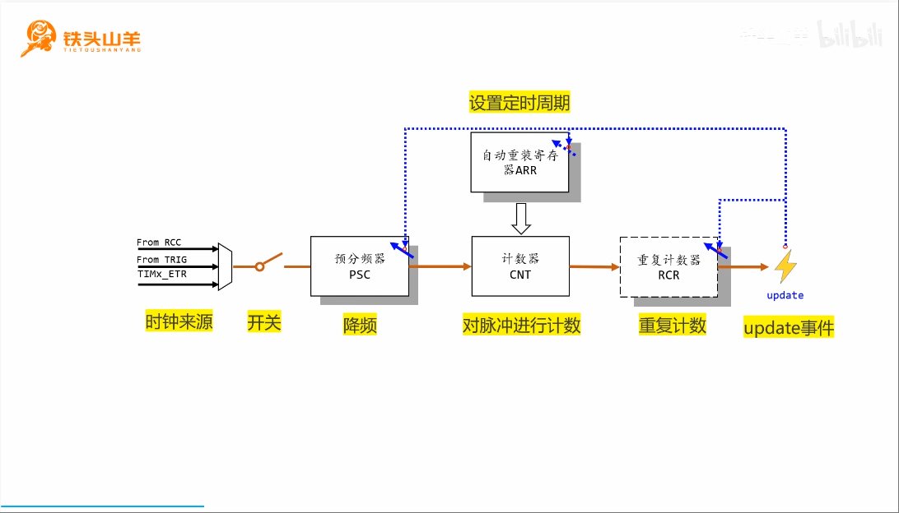
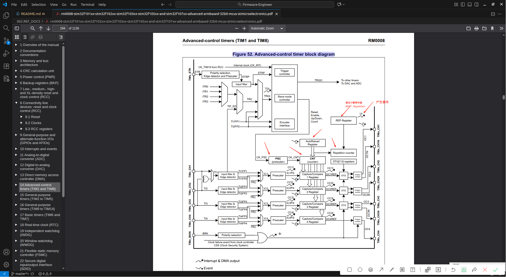
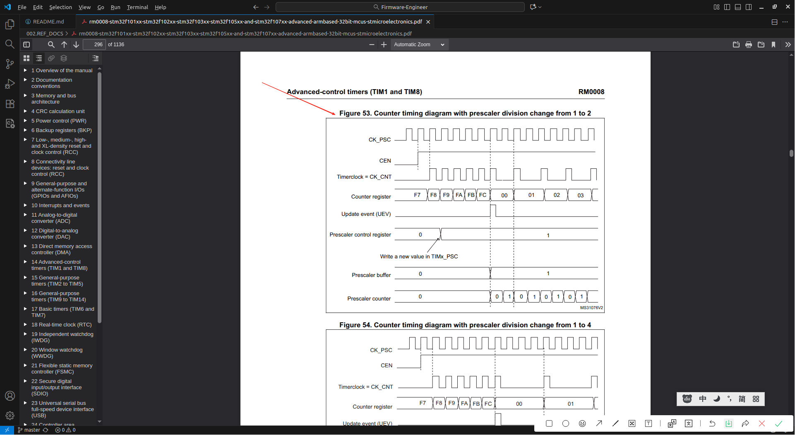

# Time Base Unit (时基单元)
学习 [[STM32 HAL库][定时器]时基单元，最佳教程，没有之一~](../999.IMG/1593167269-1-192.mp4)  & [[定时器]时基单元(补充)，最佳教程，没有之一~](../999.IMG/1597015420-1-192.mp4)

- 分频(降频): 分频后频率 = 输入频率 / (${PSC} + 1); 为什么+1,因为计数是从0开始的
- 计数器： 对输入脉冲进行计数，每计满一个定时周期就溢出一次
- 重复计数（RCR）： 每当计数器CNT溢出一次，重复计数RCR就会+1,当重复计数值达到(${RCR}+1)为什么+1,因为计数是从0开始的，那么就会产生update事件。 
- 图中阴影是“shadow register”(影子寄存器)视频中详细说明了其功能,其功能是寄存器的预加载功能,在某个事件中替换活动寄存器的值--防止跑飞
- The prescaler can divide the counter clock frequency by any factor between 1 and 65536. It is based on a 16-bit counter controlled through a 16-bit register (in the TIMx_PSC register). It can be changed on the fly as this control register is buffered. The new prescaler ratio is taken into account at the next update event.（预分频器可以将计数器时钟频率进行1至65536之间的任意倍数分频。该功能基于一个由16位寄存器（即TIMx_PSC寄存器）控制的16位计数器实现。由于控制寄存器具有缓冲机制，其数值可实时动态调整，而新的预分频比例将在下次更新事件发生时生效。）

## 手册中的时基单元
> [Figure 52. Advanced-control timer block diagram](../../../002.REF_DOCS/rm0008-stm32f101xx-stm32f102xx-stm32f103xx-stm32f105xx-and-stm32f107xx-advanced-armbased-32bit-mcus-stmicroelectronics.pdf)

## 如何理解 'Figure 53. Counter timing diagram with prescaler division change from 1 to 2'计数器时序图：预分频器分频比从1变为2时的变化
> 这个得学完时基单元的视频教程再来分析

- CK_PSC： 看上图`Figure 52. Advanced-control timer block diagram` , 这个CK_PSC是时基单元预分频器的输入，
- CEN： 'Enable the counter by setting the CEN bit in the TIMx_CR1 register.'资料中的原文,即 当CEN=1时，计数器才会开启
  + The counter is clocked by the prescaler output CK_CNT, which is enabled only when the
counter enable bit (CEN) in TIMx_CR1 register is set （计数器由预分频器输出 CK_CNT 提供时钟， 仅当 TIMx_CR1 寄存器中的计数器使能位 (CEN) 被置 1 时， 该时钟才被使能。）
- Timerclock = CK_CNT： 这个是预分频器的输出，计数器(CNT)的输入
  + CK_CNT = CK_PSC / (1 + (TIMx_PSC))
  + 所以，这张图描述的是预分频器的值由0变为1的过程。
- Counter register(TIMx_CNT): 存储的是${CNT} ， CK_CNT 来一次脉冲，TIMx_CNT就会+1,直到大于等于ARR的值（溢出），此时会产生一次输入给RCR, 然后TIMx_CNT继续从0开始，周而复始...
- Update event (UEV)： 更新事件，当可重复计数器的值溢出，则会产生一次Update中断或者事件。
- Prescaler control register ： 预分频器控制寄存器，就是时基单元中的 (TIMx_PSC) 。
- Prescaler buffer： 这应该就是类似于视频中的 影子寄存器，避免跑飞计数器的值大于阈值——不会立即生效，需要等到下一次事件产生的时候生效。
- Prescaler counter： 预分频器内部的一个计数器，是预分频器的核心组成部分，即 记满一个数(${TIMx_PSC})，则产生一次CK_CNT信号
- TIMx_PSC 更新之前，CK_PSC 一次脉冲对应着一次CK_CNT脉冲，当TIMx_PSC更新为1生效的时候，两次CK_PSC脉冲对应着一次CK_CNT脉冲

## Counter modes (计数器模式)