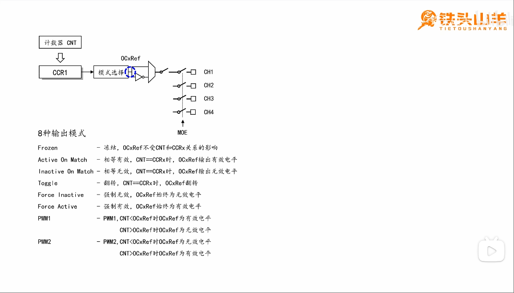

# Output-Compare (输出比较)
学习:[[STM32 HAL库][定时器]输出比较，最佳教程，没有之一~](../999.IMG/Output-Compare-1601593996-1-192.mp4) & [Figure 52. Advanced-control timer block diagram](./../../../002.REF_DOCS/rm0008-stm32f101xx-stm32f102xx-stm32f103xx-stm32f105xx-and-stm32f107xx-advanced-armbased-32bit-mcus-stmicroelectronics.pdf)

还得把图看懂: 'Figure 80. Output stage of capture/compare channel (channel 1 to 3)'
- 'Output enable circuit' : 输出使能电路, 在电子和微控制器领域中，这个术语指的是一种用于控制信号是否能够输出到外部引脚的电路

---

## 输出比较的8种输出模式

### PWM(Pulse Width Modulation，脉冲宽度调制，是一种通过调节脉冲的宽度来控制模拟设备的技术)

##### 占空比
在一个周期这个**周期**指的是时基单元的CNT的值从0到ARR所消耗的时间,而当CNT的值>=ccr的值的时候，就输出高电平内，输出高电平所占比重。

---
