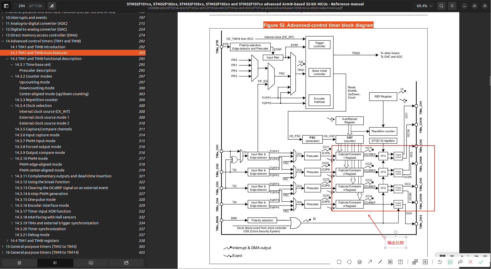

# Output-Compare (输出比较)
学习:[[STM32 HAL库][定时器]输出比较，最佳教程，没有之一~](../999.IMG/Output-Compare-1601593996-1-192.mp4) & [Figure 52. Advanced-control timer block diagram](./../../../002.REF_DOCS/rm0008-stm32f101xx-stm32f102xx-stm32f103xx-stm32f105xx-and-stm32f107xx-advanced-armbased-32bit-mcus-stmicroelectronics.pdf)

