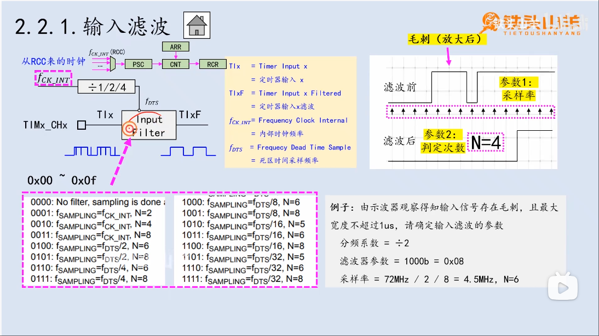

# Input capture (输入捕获)
> 学习:[[STM32 HAL库][定时器]输入捕获，最佳教程，没有之一~](../999.IMG/Input-capture-1612212037-1-192.mp4) & [[铁头山羊stm32入门教程] 7.2. 定时器之输入捕获（上）-标准库](../999.IMG/000.Input_Capture/) & [[铁头山羊stm32入门教程] 7.2. 定时器之输入捕获（下）](../999.IMG/001.Input_Capture_Distance/)


- 通道1和通道2是一对，通道3和通道4是一对，在一对通道的内部，信号可以互相引用
- 直接/间接的含义
- 原理:
   + 当‘6’处发生脉冲式，CNT的快照值将会被保存到CCRx寄存器中
     - “In Input capture mode, the Capture/Compare registers (TIMx_CCRx) are used to latch the  value of the counter after a transition detected by the corresponding ICx signal”（在输入捕获模式下，捕获/比较寄存器（TIMx_CCRx）用于锁存对应ICx信号检测到跳变时的计数器值） <sup>[rm0008-stm32f101xx-stm32f102xx-stm32f103xx-stm32f105xx-and-stm32f107xx-advanced-armbased-32bit-mcus-stmicroelectronics.pdf#‘14.3.6 Input capture mode’](../../../002.REF_DOCS/rm0008-stm32f101xx-stm32f102xx-stm32f103xx-stm32f105xx-and-stm32f107xx-advanced-armbased-32bit-mcus-stmicroelectronics.pdf) ICx出现在 ‘Figure 78. Capture/compare channel (example: channel 1 input stage)’中，应该是输入捕获信号</sup>
  + 注意图中的四个阶段，对于如何写代码有用处.

## 输入滤波（Input Filter）<sup>将输入信号中的毛刺过滤，得到比较纯净的方波信号</sup>&参数配置


如图右上角，滤波前的信号存在毛刺，这会导致程序异常，因此使用滤波器进行滤波，滤波后的信号也在图中。

这里涉及两个参数的配置:
- 输入滤波的采样频率: 
   + 等间隔对输入信号进行采样，这个等间隔就是采样频率;
- 判定次数:
   + 当采集到高电平的次数>=N,那么就认为是一个从低电平到高电平的改变;
- 阅读代码:[]()查看这两个参数怎么配置
  ```c
    // 设置输入滤波的分频系数: 设置 fCK_INT -> fDTS 的分频系数
    TIM_SetClockDivision(TIM1, TIM_CKD_DIV2);

        TIM_ICInitTypeDef icInitConfig = {
        .TIM_Channel = TIM_Channel_1,                // 配置输入渠道
        .TIM_ICPolarity = TIM_ICPolarity_Rising,     // 配置边沿检测
        .TIM_ICSelection = TIM_ICSelection_DirectTI, // 配置信号选择
        .TIM_ICPrescaler = TIM_ICPSC_DIV1,           // 配置预分频系数
        .TIM_ICFilter = 0x08};                       // 如图，此时采样频率 = fDTS/8 , 采样次数N为6
    TIM_ICInit(TIM1, &icInitConfig);
  ```


### 滤波器原理
##### 采样
等间隔<sub>**采样频率**</sub>对输入信号进行采样<sub>读取信号的高低电平</sub>，当连续获取到N<sub>**上图中的N(判定次数)**</sub>个高电平，那么才认为此处是一个上升沿。同理，当连续获取到N<sub>**上图中的N(判定次数)**</sub>个低电平，那么才认为此处是一个下降沿。

对于输入滤波，可以配置两个参数: 1). 采样频率 ; 2).判定次数


## 基本原理
在电平变化(上升沿/下降沿)时，触发ccx事件，将CNT的值保存到CCR中


## 什么是分辨率
计数器CNT每跳一次所消耗的时间。