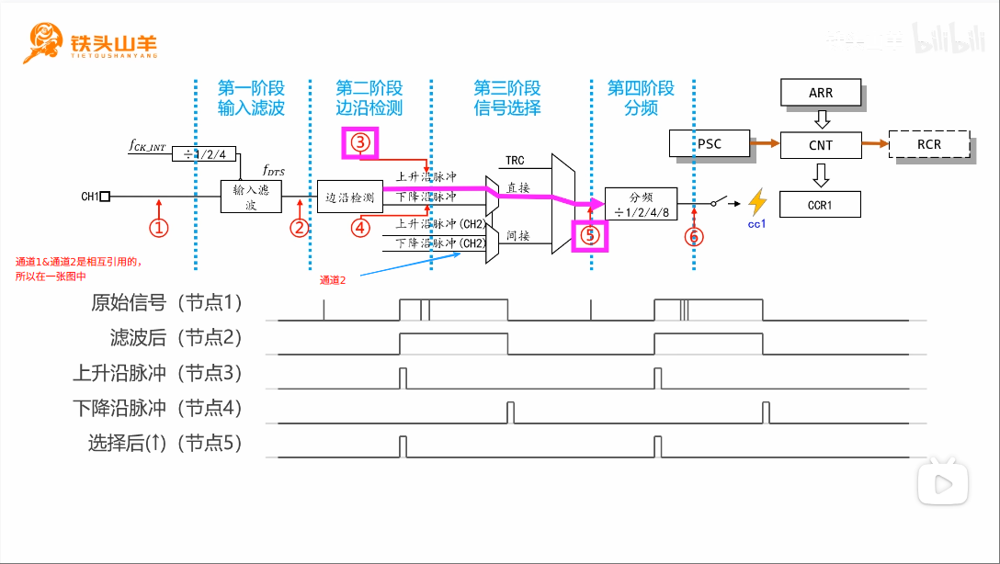

# Input capture (输入捕获)
> 学习:[Input-capture-1612212037-1-192.mp4](../999.IMG/Input-capture-1612212037-1-192.mp4)

- 通道1和通道2是一对，通道3和通道4是一对，在一对通道的内部，信号可以互相引用
- 直接/间接的含义
- 原理:
   + 当‘6’处发生脉冲式，CNT的快照值将会被保存到CCRx寄存器中
     - “In Input capture mode, the Capture/Compare registers (TIMx_CCRx) are used to latch the  value of the counter after a transition detected by the corresponding ICx signal”（在输入捕获模式下，捕获/比较寄存器（TIMx_CCRx）用于锁存对应ICx信号检测到跳变时的计数器值） [rm0008-stm32f101xx-stm32f102xx-stm32f103xx-stm32f105xx-and-stm32f107xx-advanced-armbased-32bit-mcus-stmicroelectronics.pdf#‘14.3.6 Input capture mode’](../../../002.REF_DOCS/rm0008-stm32f101xx-stm32f102xx-stm32f103xx-stm32f105xx-and-stm32f107xx-advanced-armbased-32bit-mcus-stmicroelectronics.pdf) ICx出现在 ‘Figure 78. Capture/compare channel (example: channel 1 input stage)’中，应该是输入捕获信号

## 基本原理
在电平变化(上升沿/下降沿)时，将CNT的值保存到CCR中

## 什么是分辨率
计数器CNT每跳一次所消耗的时间。