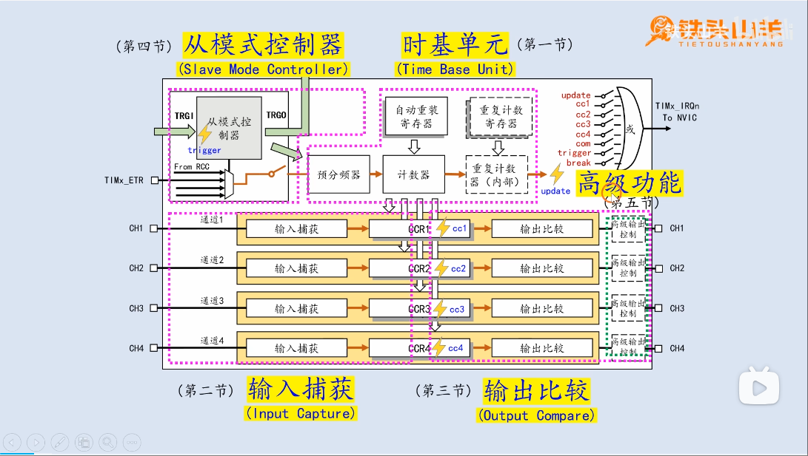

# TIM(定时器)
学习:[Advanced-control timers (TIM1 and TIM8) & General-purpose timers (TIM2 to TIM5) &General-purpose timers (TIM9 to TIM14)](../../002.REF_DOCS/rm0008-stm32f101xx-stm32f102xx-stm32f103xx-stm32f105xx-and-stm32f107xx-advanced-armbased-32bit-mcus-stmicroelectronics.pdf) & [[铁头山羊stm32入门教程] 7.1. 定时器之时基单元（上）](./999.IMG/002.TIme_Base_Unit/000.TimeBaseUnit-001/) & [[铁头山羊stm32入门教程] 7.1. 定时器之时基单元（下）#自制延迟函数](./999.IMG/002.TIme_Base_Unit/001.TimeBaseUnit-002/)

## 定时器模块简介
