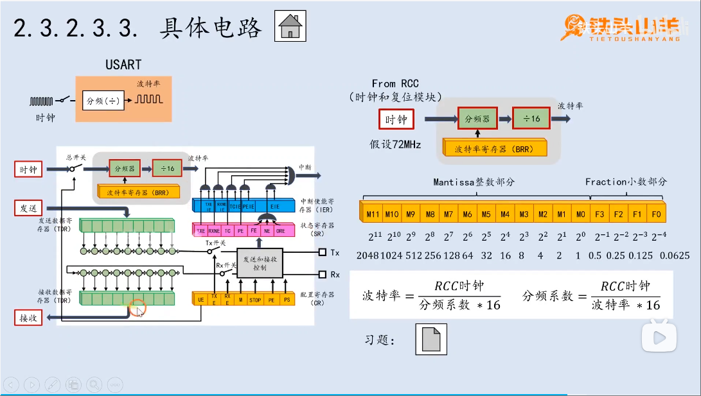
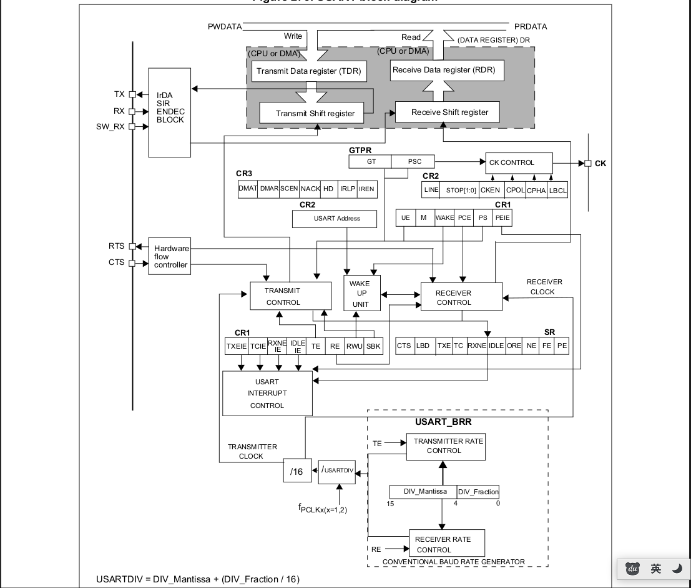

# USARTUniversal synchronous asynchronous receiver transmitter.通用同步异步收发传输器
> 还是得学会看文档!!!: [RM0008 Reference manual#Universal synchronous asynchronous receiver transmitter (USART)](../../002.REF_DOCS/rm0008-stm32f101xx-stm32f102xx-stm32f103xx-stm32f105xx-and-stm32f107xx-advanced-armbased-32bit-mcus-stmicroelectronics.pdf)

---

## 具体电路

## USART结构框图

> FROM:[RM0008 Reference manual](../../002.REF_DOCS/rm0008-stm32f101xx-stm32f102xx-stm32f103xx-stm32f105xx-and-stm32f107xx-advanced-armbased-32bit-mcus-stmicroelectronics.pdf)

---

## 通信方式
Any USART bidirectional communication requires a minimum of two pins: Receive Data In (RX) and Transmit Data Out (TX).(任何USART双向通信至少需要两个引脚：接收数据输入（RX）和发送数据输出（TX）)

阅读:[27.3 USART functional description](../../002.REF_DOCS/rm0008-stm32f101xx-stm32f102xx-stm32f103xx-stm32f105xx-and-stm32f107xx-advanced-armbased-32bit-mcus-stmicroelectronics.pdf) + [第4章 串口通信U(S)ART.pdf](../../002.REF_DOCS/第4章%20串口通信U(S)ART.pdf),可以知晓USART级别工作原理

结合图[具体电路](#具体电路) + 图[USART结构框图](#usart结构框图) 来分析USART通信方式

## 通信原理
### 核心: 波特率波特率产生原理: 在时钟信号的上升沿到来时，移位寄存器(Shift register )才会向右移动一位

由波特率来触发操作移位寄存器来发送/接收数据,所以调整时钟频率，就可以调整波特率

### 数据帧格式
如手册图:['Figure 281. Configurable stop bits'](../../002.REF_DOCS/rm0008-stm32f101xx-stm32f102xx-stm32f103xx-stm32f105xx-and-stm32f107xx-advanced-armbased-32bit-mcus-stmicroelectronics.pdf)  ，完整的数据帧包含: 起始位 、数据位（数据位长度需注意）、奇偶校验位、停止位 

##### idle frame 、Break frame 是什么?
- Break Frame 是一个特殊的、用于通信协议的帧，它的本质是：在一个字符帧的时间内，持续发送逻辑‘0’（低电平）
  + 核心原理：通过配置USART的控制寄存器，将 SBK 位置1。硬件会自动在当前数据发送完成后，在TX线上产生一个低电平脉冲，其持续时间由 LBDL 等位控制（通常是10或11位时间），然后自动将 SBK 位清零

- Idle characters
  + 在不发送数据的时候，TX引脚默认就是高电平，即 默认就是发送idle frame

### 发送数据 参考:[27.3.2 Transmitter](../../002.REF_DOCS/rm0008-stm32f101xx-stm32f102xx-stm32f103xx-stm32f105xx-and-stm32f107xx-advanced-armbased-32bit-mcus-stmicroelectronics.pdf)
- 前置步骤: 配置pin、配置数据帧格式、波特率、打开UE(打开USART) ... ,详细查阅手册
- 发送过程: 写入数据到 TDR(Transmit Data register) , 再通过串并转换电路，数据由TDR(Transmit Data register) 复制到'Transmit Shift register' , 再通过TX pin发送出去.
  + 所以，总体发送流程: 编程接口 -> TDR -> Transmit Shift register -> TX pin -> 接收方
  + 'TXE' 标识位，是 TDR 的标识位 , 若当前 TXE 为1，则说明数据已经移动到移位寄存器(Transmit Shift Register)中，那么就可以向TDR中写入下一轮要发送的数据了。如[Single byte communication章节描述](../../002.REF_DOCS/rm0008-stm32f101xx-stm32f102xx-stm32f103xx-stm32f105xx-and-stm32f107xx-advanced-armbased-32bit-mcus-stmicroelectronics.pdf)
  + When a transmission is taking place, a write instruction to the USART_DR register stores the data in the TDR register and which is copied in the shift register at the end of the current transmission.当传输发生时，对USART_DR寄存器的写指令将数据存储在TDR寄存器中，并在当前传输结束时将其复制到移位寄存器中。,当没有传输时，对TDR寄存器的写指令会立即将数据直接放到移位寄存器中

##### 寄存器&标识位 均来自于手册参考:[rm0008-stm32f101xx-stm32f102xx-stm32f103xx-...](../../002.REF_DOCS/rm0008-stm32f101xx-stm32f102xx-stm32f103xx-stm32f105xx-and-stm32f107xx-advanced-armbased-32bit-mcus-stmicroelectronics.pdf)
|寄存器|寄存器名称|标识位|标识位含义|
|-|-|-|-|
|USART_CR1|Control register 1 (USART_CR1)|TE|Transmitter enable(是否允许发送数据)|
|USART_CR1|Control register 1 (USART_CR1)|UE|USART enable,USART总开关,即 是否打开USART|

---

### 接收数据参考:[27.3.3 Receiver](../../002.REF_DOCS/rm0008-stm32f101xx-stm32f102xx-stm32f103xx-stm32f105xx-and-stm32f107xx-advanced-armbased-32bit-mcus-stmicroelectronics.pdf)
##### Start bit detection 开始位检测
一个特殊的检测： 下降沿 + 3、5、7位为0(第一次采样) + 8、9、10位为0(第二次采样), 则说明 ‘The start bit is validated(经过验证的)’

##### 寄存器&标识位 均来自于手册参考:[rm0008-stm32f101xx-stm32f102xx-stm32f103xx-...](../../002.REF_DOCS/rm0008-stm32f101xx-stm32f102xx-stm32f103xx-stm32f105xx-and-stm32f107xx-advanced-armbased-32bit-mcus-stmicroelectronics.pdf)
|寄存器|寄存器名称|标识位|标识位含义|
|-|-|-|-|
| | |RXNE| |
|||RXNEIE||

##### Overrun error
###### 发生原因
当收到数据，但RXNE并没有被重置(RDR中的数据没有处理)时，此时会发生 Overrun error
- 此时，移位寄存器(Receive Shift register)中的数据不会迁移到RDR中

###### 具体细节各个单位的状态
- The ORE bit is set
- 移位寄存器会被覆盖
- .... 

##### Noise error (噪声误差： Over-Sampling 过采样技术)
- 采样值 000 或 111 才是有效数据 以较高的频率连续采样三次，如果三次都不一致，那么就说明产生了噪声错

##### Framing error

##### 27.3.7 Parity control(奇偶校验)
- 校验规则 、 状态位(PE in USART_CR1)
- 如果是奇校验，则去除Start Bit , Stop Bit外的 Data Bit; 如果Data Bit为偶数个1,则Parity Bit需要设置为1,因为是奇校验,所以 Data Bit + Parity Bit要有奇数个1; 
  > 查阅手册:[Table 195. Frame formats](../../002.REF_DOCS/rm0008-stm32f101xx-stm32f102xx-stm32f103xx-stm32f105xx-and-stm32f107xx-advanced-armbased-32bit-mcus-stmicroelectronics.pdf)

### Fractional baud rate generation (分数波特率生成)
- Fractional ? 是因为 USARTDIV(分频系数) 不是一个整数 。查阅手册，在设置USARTDIV后，会进行一些计算，最终导致实际波特率(USART_BRR的值)和预期的波特率有误差
  + 记住表: "Table 192. Error calculation for programmed baud rates"

### 异步通信方式

### 串口流控

### 数据帧参考:[27.3.1 USART character description](../../002.REF_DOCS/rm0008-stm32f101xx-stm32f102xx-stm32f103xx-stm32f105xx-and-stm32f107xx-advanced-armbased-32bit-mcus-stmicroelectronics.pdf)

起始位、数据位、校验位、停止位 

---

## USART 中断
- 一次发送完成中断: If a frame is transmitted (after the stop bit) and the TXE bit is set, the TC bit goes high. An interrupt is generated if the TCIE bit is set in the USART_CR1 register.

---

## 波特率
### 波特率产生原理在时钟信号的上升沿到来时，移位寄存器(Shift register )才会向右移动一位
由波特率来触发操作移位寄存器来发送/接收数据,所以调整时钟频率，就可以调整波特率

---

## 串并转换 是什么、原理

---

## 各个概念
### 码元 & 波特率
- 传输的每个bit位就称为码元
- 每秒传输码元的个数，就是波特率

### 数据帧

### CK 

---

## 参考资料
- [STM32G0-Peripheral-USART-interface-USART.pdf](../../002.REF_DOCS/STM32G0-Peripheral-USART-interface-USART.pdf)
- [stm32l4_peripheral_usart.pdf](../../002.REF_DOCS/stm32l4_peripheral_usart.pdf)
- [第4章 串口通信U(S)ART.pdf](../../002.REF_DOCS/第4章%20串口通信U(S)ART.pdf)