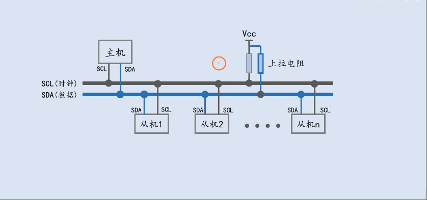
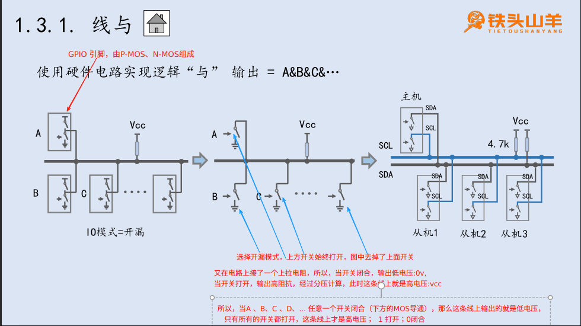
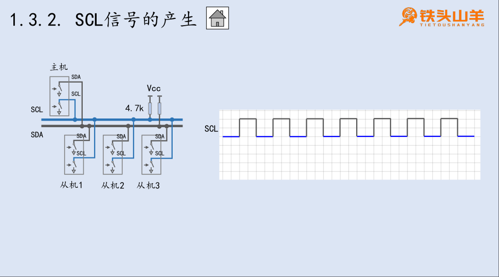

# I²C (Inter-Integrated Circuit.I²C总线)

## 背景 与串行USART的区别
串行通信-USART因为需要将单片机上USART的RX&TX引脚与接入设备的TX&RX连接，这就导致一个单片机上能通过USART接入的设备的数量有限——取决于这个单片机上支持多少个USART(且会造成大量的引脚被占用) 。 当单片机接入多个设备的时候,USART就不够了，这时候需要引入I2C——将所有的设备都接入到I2C总线上，所有的设备通过I2C总线进行通信。支持2^7个设备，为什么是2^7,阅读后续内容

## 电路图分析
### 结构框图 这个上拉电阻是4.7kΩ,见[AI-P 加速模块 硬件开发指南 05.pdf](./999.REFS/AI-P%20加速模块%20硬件开发指南%2005.pdf)

   + SCL: Serial Clock Line 串行时钟线
   + SDA: Serial Data Line  串行数据线
   + 两条电路完全一致

### 线与 —— 使用硬件电路实现逻辑与 学完这部分，你就该知道为什么I2C通信要求IO引脚是开漏输出，以及为什么要接入上拉电阻

弄清楚这个图之前，你得知道:
- STM32 的GPIO的引脚是由一对P-MOS + N-MOS构成的:图中是等效为接地、接VCC的两个开关
  |输出模式|MOS开关状态|输出值|
  |-|-|-|
  |推挽输出|GPIO口 - 写1,上方的开关导通，输出高电压3.3v; - 写0,下方的开关导通，输出0v;|P-MOS 、 N-MOS交替导通-> 可以输出0 或 1|
  |开漏输出|1. 上方的MOS管始终是断开的  - 写0,下方开关导通，接地，输出0v; - 写1,开关断开，引脚悬空，相当于是接了一个无穷大的电阻(高阻抗)|0 或 高阻抗|

- **上拉电阻接入原因**： 接入上拉电阻，是为了能在开关断开的时候，将SCL / SDA 拉至高电平，输出1

### SCL信号的产生只能由主机产生的频率可控的方波信号，如何产生？开关按照频率打开/关闭

理解好 “线与” 电路后，理解SCL信号的产生： **SCL信号只能由主机产生**
- 当主机SCL线的开关打开(写1) ， SCL线输出高电压，即输出1
- 当主机SCL线的开关闭合(写0) ， SCL线输出低电压，即输出0
- 将开关按照一定频率地闭合/打开，那么就能在SCL线上产生一定频率的方波信号了。

### SDA信号的产生

---

## 参考
- [AI-P 加速模块 硬件开发指南 05.pdf](./999.REFS/AI-P%20加速模块%20硬件开发指南%2005.pdf)