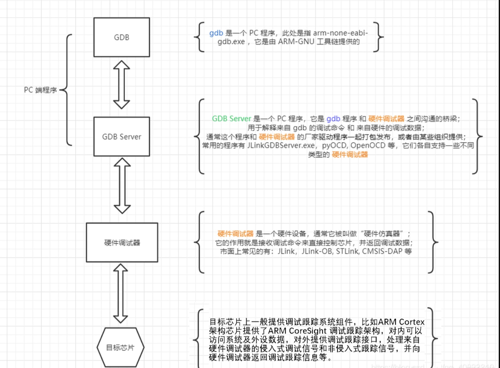

# STM32

## STM32开发方式
&nbsp;&nbsp;基于寄存器方式、**基于标准库的方式（库函数）**<sup>选择</sup>、基于HAL库方式


## 开发环境
### 宿主机
+ OS: Linux Wang 5.15.0-89-generic #99~20.04.1-Ubuntu SMP Thu Nov 2 15:16:47 UTC 2023 x86_64 x86_64 x86_64 GNU/Linux

### 交叉编译环境
&nbsp;&nbsp;交叉编译是在一个平台上生成另一个平台上的可执行代码。同一个体系结构可以运行不同的操作系统；同样，同一个操作系统也可以在不同的体系结构上运行。

&nbsp;&nbsp;要进行交叉编译，我们需要在主机平台上安装对应的交叉编译工具链（cross compilation tool chain），然后用这个交叉编译工具链编译我们的源代码，最终生成可在目标平台上运行的代码。

#### 基础概念
1. 宿主机（host） ：编辑和编译程序的平台，一般是基于X86的PC机，通常也被称为主机。
2. 目标机（target）：用户开发的系统，通常都是非X86平台。host编译得到的可执行代码在target上运行。(在主机平台上开发程序，并在这个平台上运行交叉编译器，编译我们的程序；而由交叉编译器生成的程序将在目的平台上运行)
3. 交叉编译工具链: 交叉编译工具链是一种用于在一个平台上编译另一个平台上运行的程序的软件工具集，它通常包括编译器、链接器、汇编器等组件。
   > so! 交叉编译器需要对应的是目标平台（目标机）
     >> 所以，现况： 以Linux为主机操作系统，搭配一个交叉编译系统，为嵌入式设备生成可执行程序

#### 安装交叉编译工具链
1. 宿主机(x86_64 GNU/Linux) ， 目标机(ARM Cortex-Mx) , 所以需要按照交叉编译工具链:[arm-gnu-toolchain-13.2.rel1-x86_64-arm-none-eabi.tar.xz](https://developer.arm.com/downloads/-/arm-gnu-toolchain-downloads)

#### 使用交叉编译工具链
&nbsp;&nbsp;在cmake 的 CMakeLists.txt 脚本中指定: 请参考:[000.STM32/000.STM32F103C8T6/000.STM32F103C8T6_1/000.STM32F103C8T6_1/CMakeLists.txt](../000.STM32/000.STM32F103C8T6/000.STM32F103C8T6_1/000.STM32F103C8T6_1/CMakeLists.txt)
 ```cmake
    SET(TOOLCHAIN_PATH "/home/wei/WorkSpace/apps/gcc-arm-11.2-2022.02-x86_64-arm-none-eabi/bin/")
    SET(CMAKE_ASM_COMPILER "${TOOLCHAIN_PATH}arm-none-eabi-gcc" )
    SET(CMAKE_C_COMPILER "${TOOLCHAIN_PATH}arm-none-eabi-gcc" )
    SET(CMAKE_CXX_COMPILER "${TOOLCHAIN_PATH}arm-none-eabi-c++" )
    SET(CMAKE_C_AR "${TOOLCHAIN_PATH}arm-none-eabi-ar" )
    SET(CMAKE_C_LINKER "${TOOLCHAIN_PATH}arm-none-eabi-ld" )
    SET(CMAKE_OBJCOPY "${TOOLCHAIN_PATH}arm-none-eabi-objcopy" )
    SET(CMAKE_OBJDUMP "${TOOLCHAIN_PATH}arm-none-eabi-objdump" )
    SET(CMAKE_SIZE "${TOOLCHAIN_PATH}arm-none-eabi-size" )
 ```

#### Bootloader(启动文件) & 链接库 & 可执行文件(烧录到STM32的文件) ... 详见:编译脚本
> 编译脚本: [000.STM32/000.STM32F103C8T6/000.STM32F103C8T6_1/000.STM32F103C8T6_1/CMakeLists.txt](../000.STM32/000.STM32F103C8T6/000.STM32F103C8T6_1/000.STM32F103C8T6_1/CMakeLists.txt)
1. 指定启动文件
2. 指定链接文件
3. 生成BIN文件，因为烧录到STM32的代码格式是 BIN，否则STM32无法启动

### 程序下载到STM32开发板上并运行（烧录工具的安装及使用:stlink）
&nbsp;&nbsp;通过stlink将代码烧录到板子上，使用手册:[STLink使用手册](../000.STM32/001.STLink/001.Service_Manual)
> 注意！需要将BIN格式文件烧录到STM32中，详细参考:[STLink使用手册#README.md](../000.STM32/001.STLink/README.md)

## Start UP （启航）-- 环境搭建示例-已经点亮PC13
&nbsp;&nbsp;详见项目[000.STM32F103C8T6_1](./000.STM32F103C8T6/000.STM32F103C8T6_1/000.STM32F103C8T6_1)

## 调试环境
### 软件安装
1. VSCode 插件 - 'Cortex-Debug' 
2. OpenOCD  (Open On-Chip Debugger)
   - 因为是调试STM32,所以使用: STMicroelectronics/OpenOCD
   - 安装详见: [000.STM32/003.OpenOCD](003.OpenOCD/README.md)
   - 调试原理: 
3. STLink

### 调试方式 (settings.json & launch.json)
> 调试方式无特殊之处，关键还是配置信息,具体请参考: [settings.json](../.vscode/settings.json) & [launch.json](../.vscode/launch.json) 配置内容以及注释

### 调试环境配置问题 
1. 给代码生成调试信息: 否则无法调试，即无法打断点调试
   ```txt
      在cmake的时候添加选项，生成调试信息:
        cmake -DCMAKE_BUILD_TYPE=Debug/Release path/to/source(即..,即项目源码路径，即CMakeLists.txt路径)
      或在CMakeLists.txt中直接设置参数:
        SET(ENV(CMAKE_BUILD_TYPE) "Debug") / SET(CMAKE_BUILD_TYPE "Debug")
   ```
### 调试环境注意事项
1. 在调试STM32时，需要将STM32开发板连接到电脑上，否则GDB Server会异常终止退出。详见: ’调试原理‘ （在本文搜索 "调试原理"）
   > 启动调试时，可以发现，尽管你没有操作，STLink烧录工具的灯一直在闪烁，而闪烁之前只发生在将程序烧录到STM32时，其他时刻都是常亮。