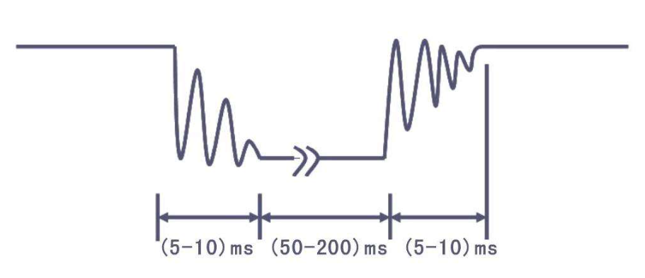

# GPIO 输入
## 按键
&nbsp;&nbsp;常见的输入设备，按下导通，松手断开。

&nbsp;&nbsp;按键抖动: 由于按键内部使用的是机械式弹簧片来进行通断的，所以在按下和松手的瞬间会伴随有一连串的抖动。

   + 如上，按下或放开的瞬间，高低电平会来回变换。所以，在程序中要过滤一下。过滤方法:
      - 加一段延时，将抖动时间耗过去。

## 传感器模块
&nbsp;&nbsp;传感器元件(光敏电阻、热敏电阻、红外接收管等)的电阻会随外界模拟量的变化而变化，通过与定值电阻分压即可得到模拟电压输出，再通过电压比较器进行二值化即可得到数字电压输出。

### 硬件电路分析
> 待补充