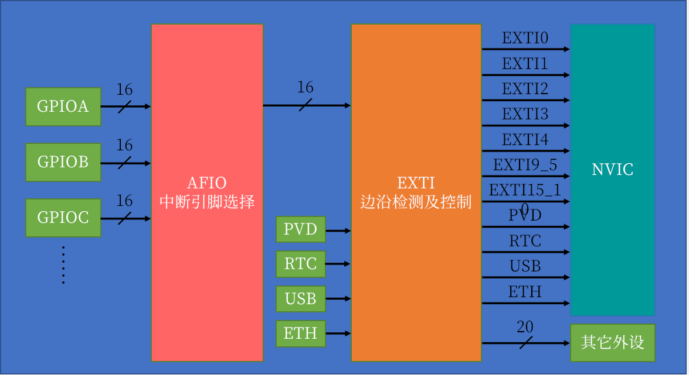

# EXTI（Extern Interrupt） 外部中断
&nbsp;&nbsp;EXTI可以监测指定GPIO口的电平信号，当其指定的GPIO口产生电平变化时，EXTI将立即向NVIC发出中断申请，经过NVIC裁决后即可中断CPU主程序，使CPU执行EXTI对应的中断程序。

+ 支持的触发方式： 上升沿/下降沿/双边沿/软件触发
  - 上升沿:  电平变为高电平的瞬间触发
  - 下降沿:  电平变为低电平的瞬间触发
  - 双边沿:  电平变为高/低电平均能触发
+ 支持的GPIO口：所有的GPIO口，但相同的PIN不能同时触发中断。
+ 通道数: 16个GPIO_Pin,以及 PVD输出、RTC闹钟、USB唤醒、以太网唤醒
+ 触发响应方式: 中断响应/事件响应

## EXTI 基本结构
> 

## 参考资料
### AFIO 
