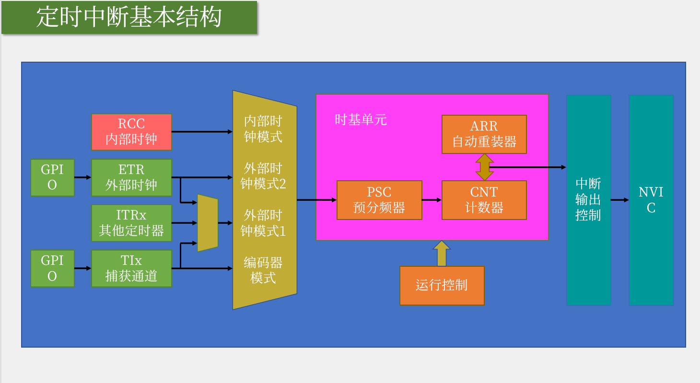
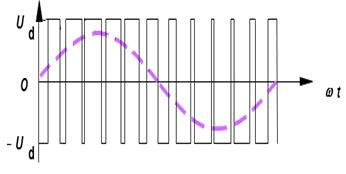
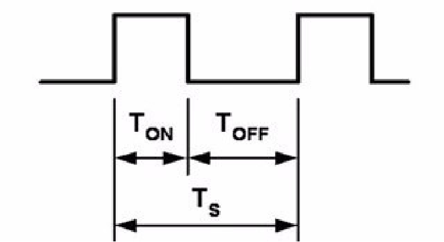
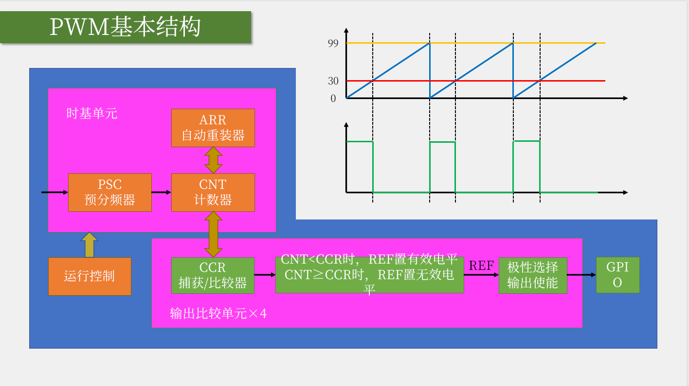
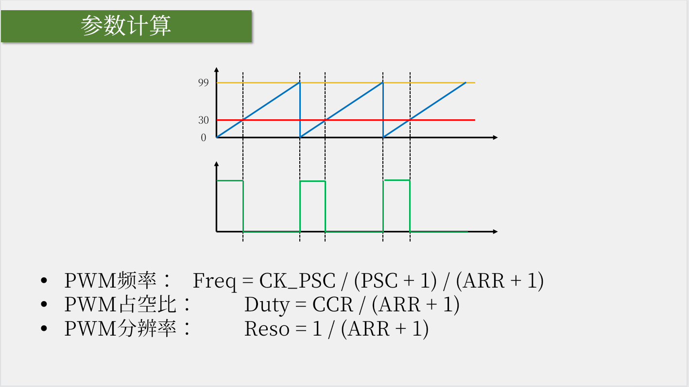

# TIM(Timer)计数器
&nbsp;&nbsp;定时器可以对输入的时钟进行计数，并在计数值达到设定值时触发中断。

## 定时器类型
|类型|编号|总线|功能|
|---|---|---|---|
|高级定时器|TIM1、TIM8|APB2|拥有通用定时器全部功能，并额外具有重复计数、死区生成、互补输出、刹车输入等功能|
|通用定时器|TIM2、TIM3、TIM4、TIM5|APB1|拥有基本定时器全部功能，并额外具有内外时钟源选择、输入捕获、输出比较、编码器接口、主从触发模式等功能|
|基本定时器|TIM6、TIM7|APB1|拥有定时中断、主模式触发DAC的功能|

&nbsp;&nbsp;STM32F103C8T6 定时器资源: TIM1、TIM2、TIM3、TIM4

## TIM中断基本结构
> 


## TIM 输出比较(OC. Output Compare)
&nbsp;&nbsp;输出比较可以通过比较CNT 与 CCR 寄存器值的关系，来对输出电平进行置0、置1或翻转的操作，用于输出一定频率和占空比的PWM波形。

&nbsp;&nbsp;每个高级定时器和通用定时器都拥有四个输出比较通道。 高级定时器的前三个通道额外拥有死区和互补输出的功能。

### PWM(Pulse Width Modulation)<sup>当做一种通信协议</sup> 简介
&nbsp;&nbsp;PWM（Pulse Width Modulation）脉冲宽度调制。在具有惯性的系统中，可以通过对一系列脉冲的宽度进行调制，来等效地获得所需要的模拟参量<sup>使用PWM波形，在数字系统中等效输出模拟量，就可以控制LED亮度，控制电机转速等功能</sup>，常应用于电机控速等领域

&nbsp;&nbsp;PWM参数:  频率 = 1 / TS            占空比 = TON / TS           分辨率 = 占空比变化步距
> 通过下图可以发现，占空比越高，等效模拟电压则越趋近于高电平；占空比越低，等效模拟电压则约趋向于低电平，等效关系一般是线性的。举例: 高电平是5V，低电平时0V，若占空比是50%，则此时的输出电压是 50% * 5V = 2.5V

- 
    
    + 曲线可以看做电平的变化曲线（等效模拟量），导致曲线上升/下降趋势是根据高低电平的时长来控制的。当高电平持续时间长，那么呈上升趋势;反之，则呈下降趋势。

-  

### 输出比较模式
|模式|描述|
|---|---|
|冻结|CNT=CCR时，REF保持为原状态|
|匹配时置有效电平|CNT=CCR时，REF置为有效电平|
|匹配时置无效电平|CNT=CCR时，REF置无效电平|
|匹配时电平翻转|CNT=CCR时，REF电平翻转|
|强制为无效电平|CNT与CCR无效，REF强制为无效电平|
|强制为有效电平|CNT与CCR无效，REF强制为有效电平|
|PWM1模式|向上计数：CNT<CCR时，REF置有效电平，CNT>=CCR时,REF置无效电平。<br/> 向下计数:CNT>CCR时，REF置无效电平，CNT<=CCR时,REF置有效电平|
|PWM2模式|向上计数：CNT<CCR时，REF置无效电平，CNT>=CCR时,REF置有效电平。<br/> 向下计数:CNT>CCR时，REF置有效电平，CNT<=CCR时,REF置无效电平|

#### PWM 基本结构 (PWM模式1)


- 红线:  CCR的值
- 蓝线： CNT 的值
- 黄线:  ARR的值
- 绿色线： 模拟量的输出
  ```txt
     REF 输出: 当CNT < CCR ，所以(REF)置高电平，CNT<=CCR，置(REF)低电平.当CNT溢出清零时，CNT<CCR，置(REF)高电平.那么此时，就可以通过设置CCR的值，来控制(REF)输出高/低电平，从而控制占空比。
  ```

#### PWM参数计算


#### 应用
&nbsp;&nbsp;通过让LED不断点亮、熄灭、点亮、熄灭，当这个点亮、熄灭的频率足够大的时候，LED就不会闪烁了，而是呈现出一个中等亮度，当调控点亮和熄灭的事件比例的时候，就能让LED呈现出不同的亮度级别。同理，对于电机，当以一个很快的频率给电机通电、断电，那么电机的速度就能维持在一个中等的速度。
> 主打就是肉眼发现不了。
