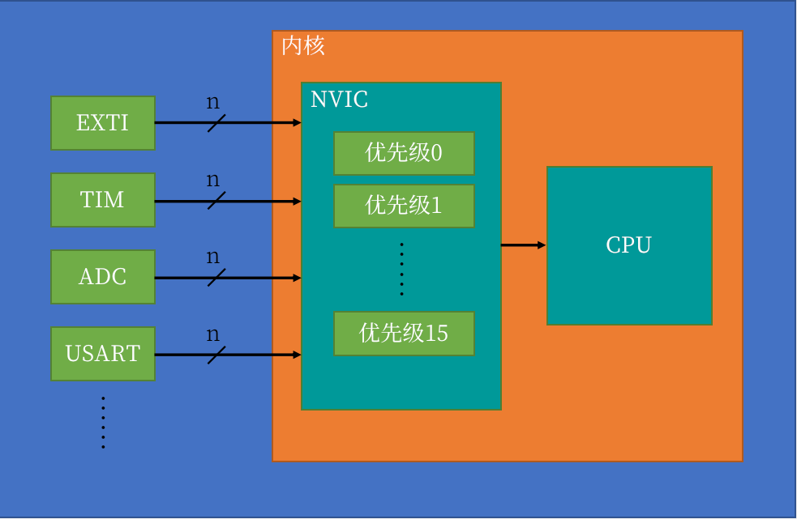

# 中断系统
## 中断
&nbsp;&nbsp;在主程序运行过程中，出现了特定的中断触发条件（中断源），使得CPU暂停当前正在运行的程序，转而去处理中断程序，处理完成后又返回原来被暂停的位置继续运行。

## 中断优先级
&nbsp;&nbsp;当有多个中断源同时申请中断时，CPU会根据中断源的优先级进行裁决，优先响应更加紧急的中断源。

## 中断嵌套
&nbsp;&nbsp;当一个中断程序正在运行时，又有新的更高优先级的中断源申请中断，CPU再次暂停当前中断程序，转而去处理新的中断程序，处理完成后依次进行返回。

## STM32中断
&nbsp;&nbsp;68个可屏蔽中断通道，包含EXTI、TIM、ADC、USART、API、I2C、RTC等多个外设。

&nbsp;&nbsp;使用NVIC统一管理中断，每个中断通道都可以拥有16个可编程的优先等级，可对优先级进行分组，进一步设置抢占优先级和响应优先级。

## NVIC(Nested Vectored Interrupt Controller: 嵌套中断向量控制器)
&nbsp;&nbsp;在STM32中，用于统一分配中断优先级和管理中断的。

### NVIC 基本结构
  > 

1. NVIC 有多个输入口，有多少个中断线路，都可以接入，如 EXTI、TIM、ADC、USART ...
2. n: 一个外设可能会同时占用多个中断通道，所以这里有n条线。
3. NVIC 只有一个输出口，NVIC 根据每个中断的优先级分配中断的先后顺序，再通过这唯一的输出口通知CPU，该处理哪一个中断。

---

## STM32F103C8 中断
> 请参考: [stm32f103c8.pdf](../../002.REF_DOCS/stm32f103c8.pdf)

&nbsp;&nbsp;通过文档 stm32f103c8.pdf 可知晓: 

### STM32F103C8中断
- EXTI中断,-> [001.嵌入式知识库/003.INTERRUPT/000.STM32F103C8T6/000.EXTI中断.md](./../../001.嵌入式知识库/003.INTERRUPT/000.STM32F103C8T6/000.EXTI中断.md)
---

## 参考资料
1. [NVIC(Nested Vectored Interrupt Controller):嵌套中断向量控制器 介绍&编程文档](https://developer.arm.com/documentation/dui0552/a/cortex-m3-peripherals/nested-vectored-interrupt-controller?lang=en)
   > 注意内核版本，这里是Cortex-M3