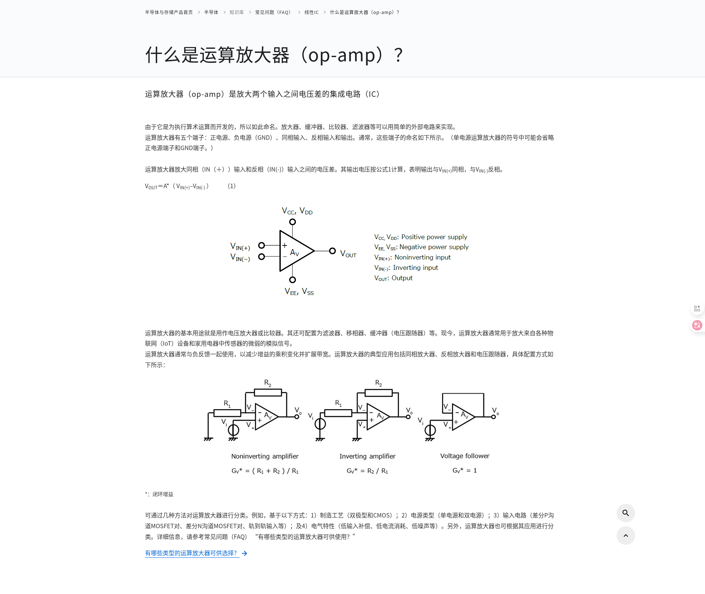

# 运算放大器（op-amp）
运算放大器的基本用途就是用作电压放大器或比较器，也可对模拟电压进行二值化来获取数字电压输出

上图中的Av是‘open-loop gain (i.e., the ratio of output voltage to input voltage).’ ，Open-loop gain（开环增益），指的是运算放大器在没有任何外部反馈（即输出端与输入端之间没有连接任何元件）时的电压放大倍数。 具体值在  [application_note_en_20210326_AKX00142.pdf](./999.DOCS/application_note_en_20210326_AKX00142.pdf) 中（10^5 (100db)#`2.4. Noninverting amplifier`）。 并且会受到电源电压的限制，即当计算的值大于电源电压时，就取电源电压。参考:[application_note_en_20210326_AKX00142.pdf](./999.DOCS/application_note_en_20210326_AKX00142.pdf)#3.6. Maximum output voltage swin

## 参考资料
- [什么是运算放大器（op-amp）？](https://toshiba-semicon-storage.com/cn/semiconductor/knowledge/faq/linear_opamp/what-is-an-operational-amplifier.html)
- [application_note_en_20210326_AKX00142.pdf](./999.DOCS/application_note_en_20210326_AKX00142.pdf)