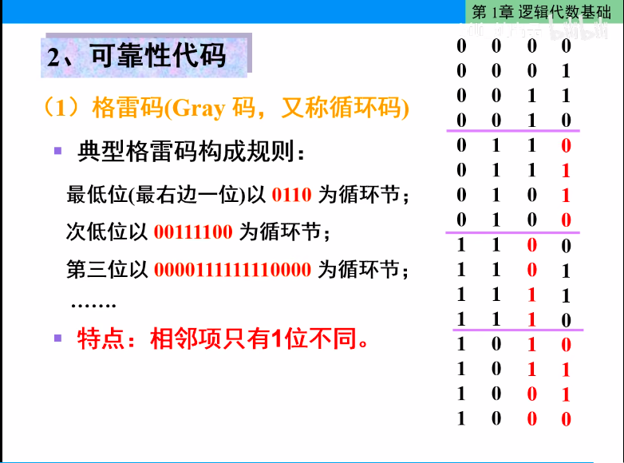
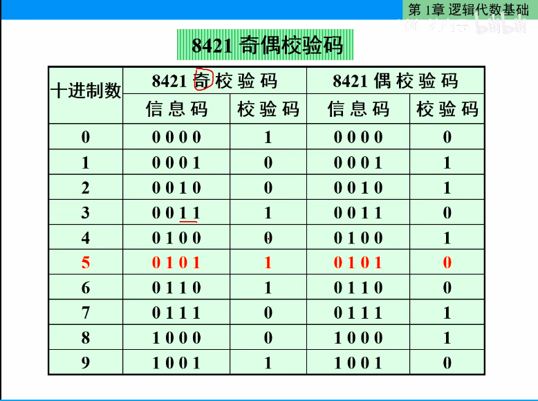

## 码制
## 可靠性代码
### 格雷码(Gray 码，又称循环码)
典型格雷码构成规则：
1. 最低位（最右一位）以0110为循环节
2. 次低位以 00111100 为循环节
3. 第三位以 0000111111110000为循环节

特点： 相邻项只有一位不同


---

### 奇偶校验码
```txt
    组成:  
         a. 信息码： 需要传送的信息本身
         b. 1 位校验位: 取值0或1,以使整个代码中的1的个数为奇数或偶数。
            使 1 的个数为奇数的称为奇校验；1的个数为偶数的称偶校验
```
